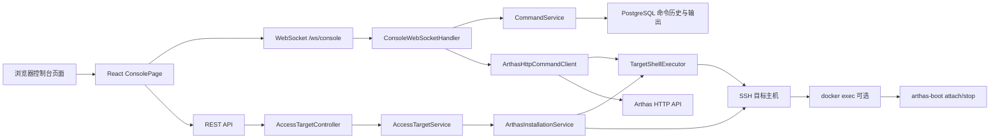
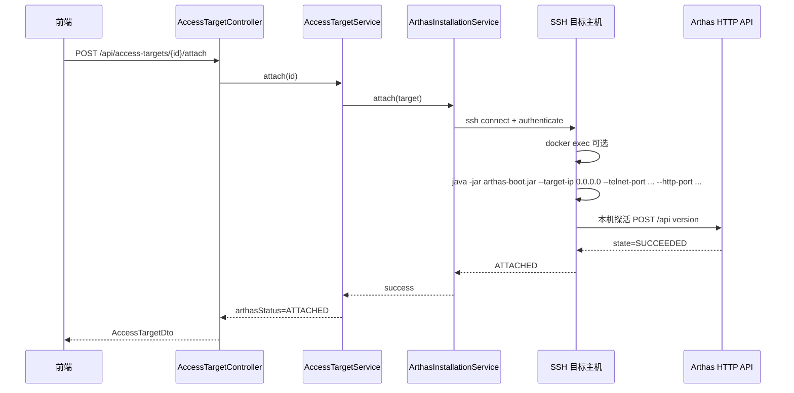
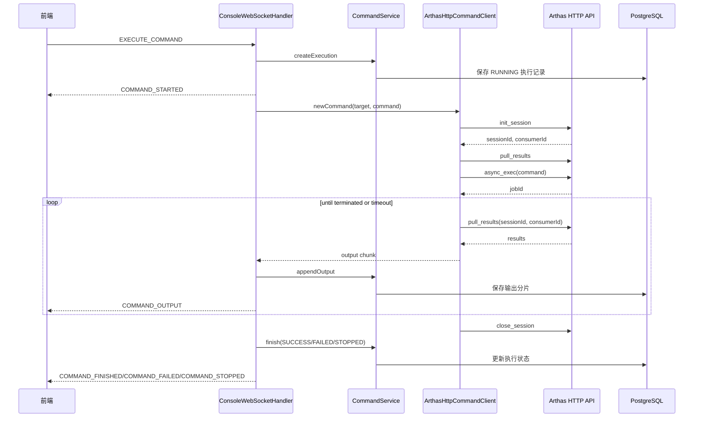
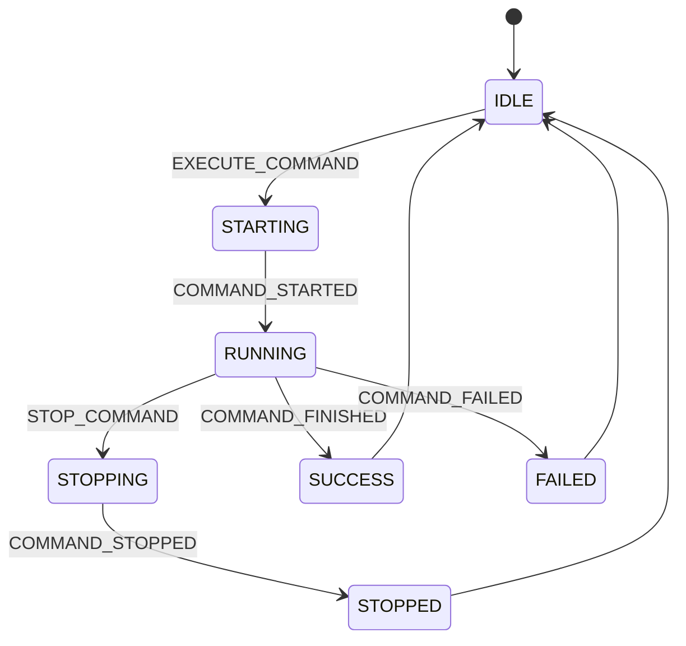

# Fordring Arthas 控制台终端交互设计

## 1. 设计目标

本文档描述 Fordring 前端控制台到真实 Arthas 的终端交互设计，重点回答四个问题：

- 用户进入控制台时，如何明确知道当前连接的是哪个目标环境。
- 前端终端如何通过 WebSocket 与后端保持命令级交互。
- 后端如何真正接入、调用、停止 Arthas，而不是返回模拟输出。
- 后续如何将当前只读终端升级为 xterm.js 终端组件。

本设计的核心原则是：前端不直接连接目标机器和 Arthas，所有目标访问、凭据、认证、审计和命令生命周期都由后端统一收口。

## 2. 当前实现范围

当前已经实现真实 Arthas 交互闭环：

- 接入目标从 `/console` 选择，进入 `/console/:targetId`。
- 控制台头部展示环境、接入名称、主机、容器、PID 和 Arthas 状态。
- 控制台命令通过 WebSocket 发送给后端。
- 后端通过 Arthas HTTP API 执行命令，不再使用 demo/mock 输出；Docker 容器目标通过 SSH + `docker exec` 在容器内访问 `127.0.0.1:{httpPort}/api`。
- `attach` 会通过 SSH 登录目标主机，并在 Docker 容器或物理机进程中启动 `arthas-boot`。
- `detach` 会通过 SSH 进入目标环境调用 Arthas `stop`。
- 后端为 Arthas HTTP API 增加 Basic Auth；Docker 容器目标不要求将 Arthas HTTP 端口暴露给 Fordring 后端。
- 快捷 `dashboard` 使用 `dashboard -n 1`，避免持续刷新命令因为默认超时被判失败。

当前前端终端展示已切换为 xterm.js，只读输出组件和 WebSocket 会话 Hook 已落地。后续若要支持原生输入、重连恢复和更完整的终端行为，可继续按第 8 节演进。

## 3. 总体架构



职责划分：

| 层 | 职责 |
| --- | --- |
| React 控制台 | 目标选择、命令输入、终端展示、停止命令、断开按钮 |
| WebSocket Handler | 命令会话编排、异步执行、流式推送、停止指令 |
| CommandService | 创建执行记录、追加输出、结束状态落库 |
| ArthasHttpCommandClient | 封装 Arthas HTTP API session、async exec、pull results、interrupt、close；Docker 目标通过目标环境本地 API 调用 |
| TargetShellExecutor | 统一封装 SSH 登录、凭据认证、主机脚本执行和 Docker `exec` 包装 |
| ArthasInstallationService | 通过 SSH/Docker 执行安装、attach、detach 脚本 |
| AccessTargetService | 维护目标状态、失败原因、操作审计 |

## 4. 用户交互流程

### 4.1 进入控制台

用户点击左侧「控制台」进入 `/console`，页面展示当前可进入的已接入目标列表。

目标行展示：

- 环境标签，例如 `prod`、`test`、`未标环境`。
- 接入名称。
- 主机地址。
- Docker 容器名或进程名。
- PID。
- Arthas 状态。

用户点击某个目标后进入 `/console/:targetId`。控制台页面头部再次展示当前目标信息，避免多个环境并存时误操作。

### 4.2 执行命令

用户可以通过两种方式执行命令：

- 点击快捷按钮，例如 `dashboard`、`thread`、`jvm`、`memory`。
- 在输入框中输入任意 Arthas 命令并回车或点击「执行」。

快捷 `dashboard` 实际发送 `dashboard -n 1`。原因是 `dashboard` 默认持续刷新，适合交互式终端，但不适合作为一次性快捷命令。

### 4.3 停止命令

用户点击「停止」后，前端发送 `STOP_COMMAND`。后端对正在运行的 Arthas session 调用 `interrupt_job`，同时取消本地异步任务，并将执行状态更新为停止。

### 4.4 断开控制台

用户点击「断开」后，前端调用：

```text
POST /api/access-targets/{id}/detach
```

后端不会只更新数据库状态，而是通过 SSH 登录目标环境，进入容器或主机进程环境，调用 Arthas `stop`。断开成功后目标状态更新为 `DISCONNECTED`，前端关闭 WebSocket 并回到 `/console`。

## 5. WebSocket 协议

### 5.1 连接

```text
GET /ws/console?targetId={targetId}
```

当前实现中 `targetId` 主要由消息体携带，连接参数用于语义标识和后续扩展。生产化后应在连接建立时校验目标是否存在、是否可访问、是否已接入。

### 5.2 执行命令

前端发送：

```json
{
  "type": "EXECUTE_COMMAND",
  "requestId": "uuid",
  "targetId": 7,
  "command": "dashboard -n 1",
  "timeoutSeconds": 30,
  "source": "MANUAL",
  "riskConfirmed": true
}
```

后端返回：

```json
{
  "type": "COMMAND_STARTED",
  "requestId": "uuid",
  "executionId": 18
}
```

命令输出：

```json
{
  "type": "COMMAND_OUTPUT",
  "requestId": "uuid",
  "executionId": 18,
  "chunk": "Welcome to Arthas version 4.2.0 pid=97\n"
}
```

命令成功：

```json
{
  "type": "COMMAND_FINISHED",
  "requestId": "uuid",
  "executionId": 18,
  "status": "SUCCESS",
  "durationMs": 5421
}
```

命令失败：

```json
{
  "type": "COMMAND_FAILED",
  "requestId": "uuid",
  "executionId": 18,
  "message": "无法通过 SSH/Docker Exec 调用 Arthas HTTP API 127.0.0.1:8563/api：Connection refused"
}
```

### 5.3 停止命令

前端发送：

```json
{
  "type": "STOP_COMMAND",
  "requestId": "uuid",
  "targetId": 7,
  "executionId": 18
}
```

后端返回：

```json
{
  "type": "COMMAND_STOPPING",
  "requestId": "uuid",
  "executionId": 18
}
```

最终返回：

```json
{
  "type": "COMMAND_STOPPED",
  "requestId": "uuid",
  "executionId": 18
}
```

## 6. 后端 Arthas 交互流程

### 6.1 attach 流程



启动 Arthas 时使用配置项：

| 配置 | 说明 |
| --- | --- |
| `fordring.arthas.default-telnet-port` | 默认 Telnet 端口 |
| `fordring.arthas.default-http-port` | 默认 HTTP 端口 |
| `fordring.arthas.username` | Fordring 管理的 Arthas 用户名 |
| `fordring.arthas.password` | Fordring 管理的 Arthas 密码 |

Docker 目标会执行：

```text
docker inspect {container} && docker exec {container} sh -lc {script}
```

物理机 Java 目标会执行：

```text
sh -lc {script}
```

### 6.2 命令执行流程



命令传输策略：

| 目标类型 | Arthas API 调用方式 | 说明 |
| --- | --- | --- |
| `DOCKER_CONTAINER` | SSH 到目标主机后执行 `docker exec {container} sh -lc 'curl http://127.0.0.1:{httpPort}/api ...'` | 不依赖容器端口发布，也不依赖 Fordring 后端到目标容器网络直连。 |
| `PHYSICAL_JAVA` | 后端直连 `http://{host}:{httpPort}/api` | 当前保留原实现；后续可同样切到 SSH 本机 `curl` 或 SSH tunnel。 |

Arthas HTTP API 使用 Basic Auth：

```text
Authorization: Basic base64(username:password)
```

### 6.3 detach 流程

断开时后端通过 SSH 执行目标环境脚本，向本机 Arthas HTTP API 发送：

```json
{
  "action": "exec",
  "command": "stop",
  "execTimeout": "2000"
}
```

`stop` 可能导致 HTTP 连接被服务端主动关闭，因此脚本将以下结果视为已断开：

- `state=SUCCEEDED`
- `Connection refused`
- `Connection reset`
- `Empty reply from server`

## 7. 状态与错误处理

### 7.1 目标状态

| 状态 | 说明 |
| --- | --- |
| `NOT_ATTACHED` | 已保存目标，但未接入 Arthas |
| `ATTACHED` | attach 成功，允许进入控制台 |
| `CHECK_FAILED` | 检查失败 |
| `ATTACH_FAILED` | attach 失败 |
| `DISCONNECTED` | 已主动断开 |

### 7.2 命令状态

| 状态 | 说明 |
| --- | --- |
| `RUNNING` | 后端已创建执行记录并开始执行 |
| `SUCCESS` | Arthas job 正常结束 |
| `FAILED` | 连接、认证、调度或执行失败 |
| `STOPPED` | 用户主动停止或后端中断成功 |

### 7.3 常见错误

| 错误 | 含义 | 处理 |
| --- | --- | --- |
| `ConnectException` | 目标 Arthas HTTP 端口不可达 | 提示真实连接失败，不展示模拟输出 |
| `401 Unauthorized` | Arthas HTTP API 需要认证或密码不一致 | 检查 attach 是否由 Fordring 启动、配置是否一致 |
| `ATTACH_TIMEOUT` | Arthas 启动后本机探活失败 | 展示目标日志摘要 |
| `ARTHAS_BOOT_MISSING` | 目标环境缺少 `arthas-boot.jar` | 引导用户先安装 Arthas |
| 命令超时 | 持续命令未在超时时间内结束 | 后端发送 interrupt，并标记失败或停止 |

## 8. xterm.js 终端组件设计

当前 React 页面已经用 `TerminalView` 封装 xterm.js 展示输出。为了保持页面职责清晰，WebSocket 连接、执行、停止和运行状态由 `useTerminalSession` 管理。

### 8.1 组件职责

```text
frontend/src/components/terminal/
  TerminalView.tsx
  useTerminalSession.ts
```

| 组件/Hook | 职责 |
| --- | --- |
| `TerminalView` | 创建 xterm 实例、挂载 DOM、写入输出、处理 resize |
| `useTerminalSession` | 管理 WebSocket 生命周期、发送命令、停止命令、连接状态 |

### 8.2 写入策略

后端推送 `COMMAND_OUTPUT.chunk` 后，前端调用：

```ts
terminal.write(chunk.replace(/\n/g, '\r\n'));
```

注意事项：

- xterm.js 使用 `\r\n` 换行效果更接近真实终端。
- 不要把每次 React state 更新绑定到完整输出文本，否则大输出会触发频繁重渲染。
- 命令历史保存由后端负责，前端仅维护必要的可复制缓冲。
- 大输出需要限制前端保留长度，例如最多保留最近 1 MB 文本用于复制。

### 8.3 输入策略

第一阶段建议仍采用「命令输入框 + xterm 输出区」：

- 输入框负责命令编辑、历史上下键、风险确认。
- xterm 只负责展示输出和复制。
- 这样可以避免完整伪终端协议、光标编辑、补全等复杂度。

第二阶段再支持 xterm 原生输入：

- 用户在 xterm 中输入字符。
- 前端本地维护当前输入行。
- 回车时发送完整 `EXECUTE_COMMAND`。
- 后端仍以命令为单位执行，不暴露原始 shell。

不建议在 MVP 中实现真正 PTY 级双向字节流，因为 Arthas HTTP API 本身是命令/job 模型，不是原生终端流模型。

## 9. 可靠性设计

### 9.1 命令生命周期

每条命令必须拥有唯一 `executionId`。前端所有后续停止、输出、完成事件都以 `executionId` 为准，不只依赖 `requestId`。

推荐状态机：



### 9.2 单目标并发

当前代码通过后端运行任务表维护运行中的 execution。生产化建议增加单目标互斥：

- 同一 `targetId` 同一时间只允许一个持续命令运行。
- 若用户重复点击执行，应返回明确错误。
- 对短命令可排队，但 MVP 建议直接拒绝，降低复杂度。

### 9.3 WebSocket 断开

浏览器断开时不应直接杀掉正在执行的命令，除非用户明确点击停止。原因是刷新页面、网络抖动不应导致诊断命令被意外终止。

推荐策略：

- 命令继续执行并落库。
- 新页面可通过命令历史查看结果。
- 后续可支持按 `executionId` 重新订阅实时输出。

### 9.4 输出截断

后端保存输出应受 `fordring.command.output-max-bytes` 控制。超过限制后：

- WebSocket 可以继续推送给当前浏览器。
- 数据库停止追加或标记 `outputTruncated=true`。
- 命令历史展示截断提示。

## 10. 安全设计

### 10.1 凭据边界

前端永远不接触 SSH 密码、SSH Key、Arthas 密码。所有敏感信息都在后端配置或凭据服务中使用。

### 10.2 Arthas 暴露面

Arthas 启动时绑定：

```text
--target-ip 0.0.0.0
```

物理机 Java 目标当前仍依赖后端可远程访问 HTTP API，必须配合：

- Basic Auth。
- 受控内网或 VPN。
- 防火墙限制访问来源。

Docker 容器目标已经通过 SSH + `docker exec` 访问容器内 `127.0.0.1:{httpPort}/api`，不再要求把 8563 暴露给 Fordring 后端。后续建议把物理机目标也统一迁移到 SSH 本机调用、SSH tunnel 或 Agent 反连，进一步减少端口暴露。

### 10.3 命令风险控制

高风险命令需要后端判断，前端只负责展示二次确认。不能只依赖前端禁用。

推荐风险命令包括：

- `stop`
- `shutdown`
- `reset`
- `vmtool`
- 可能修改运行时状态的 `ognl`、`tt`、`jad` 等组合命令。

### 10.4 审计

以下操作必须审计：

- 目标新增、修改、删除。
- Arthas 安装、检查、接入、断开。
- 命令执行、停止、失败。
- 高风险命令确认。

审计字段至少包括操作者、目标 ID、操作类型、结果、失败原因、时间。

## 11. 代码映射

| 设计点 | 当前文件 |
| --- | --- |
| 控制台页面、目标选择、断开按钮、快捷命令 | `frontend/src/pages/ConsolePage.tsx` |
| 左侧控制台入口 | `frontend/src/ui/AppLayout.tsx` |
| 接入管理入口动作 | `frontend/src/pages/AccessPage.tsx` |
| WebSocket 命令编排 | `backend/src/main/java/com/fordring/websocket/ConsoleWebSocketHandler.java` |
| Arthas HTTP API 客户端 | `backend/src/main/java/com/fordring/arthas/ArthasHttpCommandClient.java` |
| 目标环境 Shell 执行器 | `backend/src/main/java/com/fordring/arthas/TargetShellExecutor.java` |
| Arthas 安装、attach、detach | `backend/src/main/java/com/fordring/arthas/ArthasInstallationService.java` |
| 目标状态维护 | `backend/src/main/java/com/fordring/target/AccessTargetService.java` |
| 命令记录与输出保存 | `backend/src/main/java/com/fordring/command/CommandService.java` |
| Arthas 端口与认证配置 | `backend/src/main/resources/application.yml`、`docker-compose.yml` |

## 12. 后续演进

建议按以下顺序继续演进：

1. 抽出 `TerminalView` 和 `useTerminalSession`，用 xterm.js 替换当前 `div.terminal`。
2. 后端增加单目标命令互斥，避免持续命令并发。
3. 增加 WebSocket 重连与按 `executionId` 重新订阅。
4. 将物理机目标的 Arthas HTTP 访问从直接端口改为 SSH 本机调用、SSH tunnel 或 Agent 通道。
5. 增加命令风险分级与后端强校验。
6. 增加目标健康检查，把旧的 `ATTACHED` 状态自动修正为不可达。
7. 增加 E2E 测试覆盖：选择目标、执行 `dashboard -n 1`、停止持续 `dashboard`、断开控制台。
