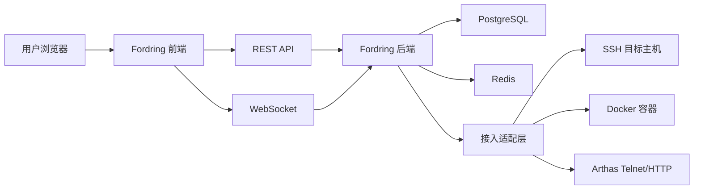
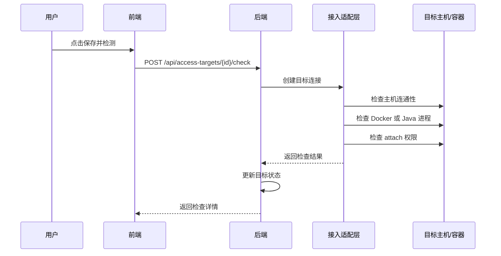
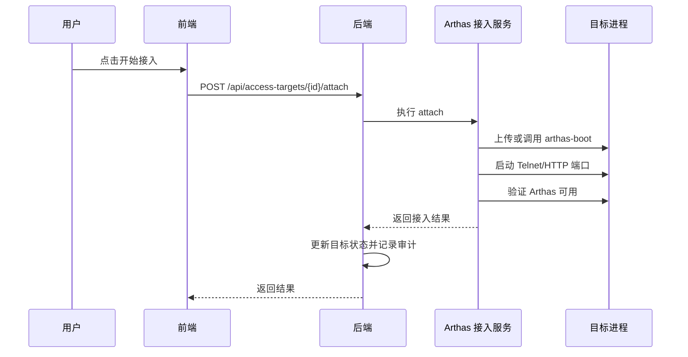
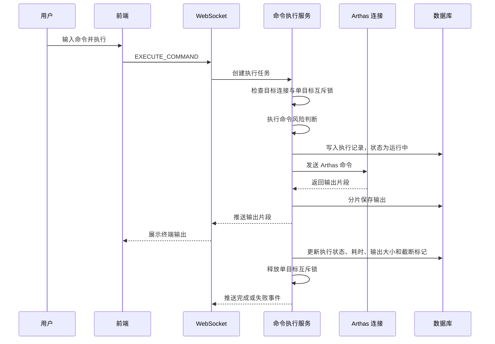
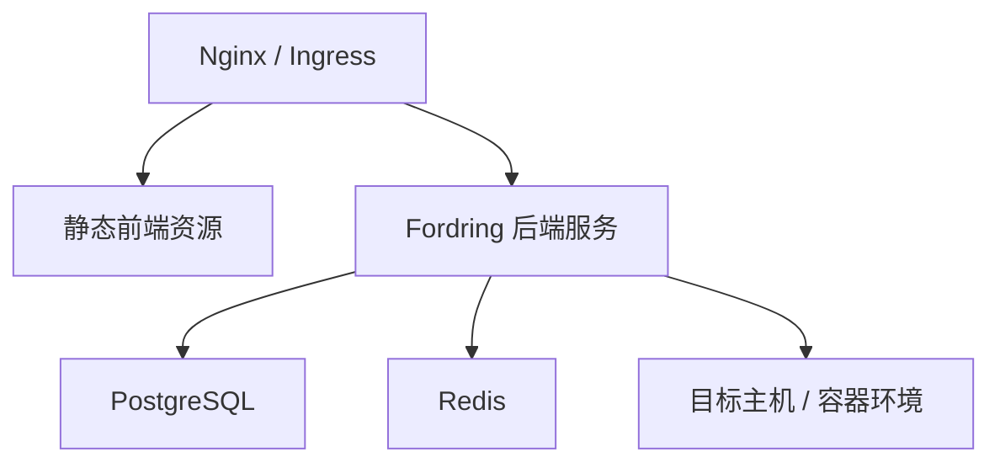

# Fordring 开发设计文档

## 1. 设计目标

Fordring 的第一阶段目标是交付一个可运行的 Arthas 管理平台，支持接入目标管理、Arthas 接入、Web 控制台命令执行、命令历史审计和常用命令复用。

开发设计遵循以下原则：

- 先完成闭环：从新增目标、接入 Arthas、执行命令到查看历史形成完整链路。
- 接入方式可扩展：第一版优先支持 SSH/Docker 直连接入，定位为本地、测试和受控内网环境的快速 MVP；生产化后再扩展 Arthas Tunnel、Kubernetes Pod 和自研 Agent。
- 命令执行可审计：所有 attach、detach、execute、re-execute、save-command 操作都要有记录。
- 风险控制前置：为命令超时、危险命令拦截、权限控制预留明确扩展点。
- 前后端职责清晰：前端负责交互与状态展示，后端负责目标管理、命令执行、审计落库和连接适配。

## 2. MVP 决策

| 决策项 | MVP 结论 | 说明 |
| --- | --- | --- |
| 产品定位 | 快速 MVP | 第一版优先跑通接入、执行、历史、审计闭环 |
| 接入方式 | SSH/Docker 直连 | 仅面向本地、测试和受控内网环境，不直接暴露公网 |
| 凭据保存 | 加密落库 | 开发/测试允许数据库主密钥；生产必须切换到环境变量或 KMS/Vault |
| 登录体系 | 不做应用内登录 | 单用户模式，默认操作者为 `admin` 或启动配置中的操作者名称 |
| 访问保护 | 部署级保护 | 依赖内网、VPN、Nginx Basic Auth、反向代理鉴权等方式 |
| 目标发现 | 按主机实时发现 + 手动兜底 | 用户输入主机和凭据后查询容器/Java 进程；接入目标只保存 Java 进程 PID，发现失败时允许手填 PID |
| 目标状态 | 操作结果维护 | 不做后台健康检查；进入控制台或执行命令前实时校验连接，失败时被动修正状态 |
| 命令类型 | 支持可停止的持续输出命令 | 不做完整交互式终端，但支持流式输出、超时和停止 |
| 命令并发 | 多目标并发，单目标串行 | 同一目标同一时间只允许一个命令运行 |
| 输出保存 | 分片保存，按大小截断 | 默认单次命令最多保存 1 MB 输出，超过后继续推送但停止落库 |
| 命令风险 | 黑名单 + 二次确认 | 后端执行前判断风险，前端负责确认交互 |
| 历史与审计 | 分开保存 | 命令历史面向复盘，审计日志面向安全追踪 |

## 3. 技术选型

### 3.1 后端

| 类别 | 选型 | 说明 |
| --- | --- | --- |
| 语言与框架 | Java 21 + Spring Boot 3 | 与 Java 诊断领域天然契合，便于后续复用 Arthas 生态能力 |
| Web API | Spring MVC | 提供 REST 接口 |
| 实时通信 | Spring WebSocket | 控制台命令输出流式推送 |
| 数据访问 | Spring Data JPA 或 MyBatis Plus | MVP 可二选一，团队熟悉优先 |
| 数据库 | PostgreSQL | 存储目标、加密凭据、命令历史、输出分片、审计日志、保存命令 |
| 缓存与会话 | Redis | 存储短期执行状态、WebSocket 会话映射、单目标命令互斥锁 |
| SSH | Apache Mina SSHD 或 SSHJ | 连接物理机执行脚本与命令 |
| Docker | docker-java 或远程 CLI 适配 | 支持容器内 Java 进程发现与 Arthas attach |
| 任务执行 | Spring TaskExecutor | 管理异步检测、attach 和命令执行 |

### 3.2 前端

| 类别 | 选型 | 说明 |
| --- | --- | --- |
| 构建工具 | Vite | 快速开发与构建 |
| 框架 | React + TypeScript | 适合管理台复杂状态与组件化 |
| 路由 | React Router | 页面路由 |
| 请求 | Axios 或 Fetch 封装 | 统一错误处理与认证头 |
| 状态管理 | Zustand 或 React Query | React Query 适合服务端状态，Zustand 适合局部 UI 状态 |
| UI 组件 | Ant Design 或 shadcn/ui | 管理台优先选择表格、表单、弹窗能力成熟的组件库 |
| 终端展示 | xterm.js 或自定义只读终端 | 控制台输出需要等宽字体、滚动、复制能力 |

## 4. 总体架构



后端采用模块化单体架构。第一版避免过早拆分微服务，但内部模块边界要清楚，便于后续拆出 Agent 服务或命令执行服务。

## 5. 后端模块设计

### 5.1 模块划分

| 模块 | 职责 |
| --- | --- |
| 单用户上下文模块 | 维护默认操作者名称，解析可选的 `X-Fordring-Operator` 请求头 |
| 接入目标模块 | 目标增删改查、搜索筛选、状态统计 |
| 目标检测模块 | 主机连通性、Docker 可用性、Java 进程发现、attach 权限检测 |
| 凭据模块 | 凭据加密、解密、脱敏展示、主密钥管理 |
| Arthas 接入模块 | 安装/启动 Arthas、配置端口、断开连接、状态刷新 |
| 命令执行模块 | 发送 Arthas 命令、处理超时、停止命令、流式输出、执行结果归档 |
| 命令历史模块 | 查询历史、查看详情、再次执行、保存命令 |
| 保存命令模块 | 常用命令管理、快捷显示控制 |
| 命令安全模块 | 黑名单、二次确认、命令风险等级判断 |
| 审计日志模块 | 记录关键操作、操作者、目标、结果与失败原因 |
| 连接适配层 | 屏蔽 SSH、Docker、Arthas Telnet/HTTP 等底层差异 |

### 5.2 推荐包结构

```text
backend/
  src/main/java/com/fordring/
    FordringApplication.java
    common/
      api/
      error/
      security/
      pagination/
    operator/
    target/
    probe/
    credential/
    arthas/
    command/
    commandsafety/
    savedcommand/
    audit/
    infrastructure/
      ssh/
      docker/
      websocket/
      persistence/
```

## 6. 核心领域模型

### 6.1 接入目标

接入目标表示一个可以被 Fordring 管理并接入 Arthas 的 Java 运行实例。

关键字段：

| 字段 | 类型 | 说明 |
| --- | --- | --- |
| id | Long | 主键 |
| name | String | 接入名称 |
| environment | String | 环境标签 |
| host | String | 主机 IP 或主机名 |
| sshPort | Integer | SSH 端口，默认 22 |
| authType | Enum | 认证方式：密码、SSH Key、Agent Token 等 |
| username | String | 登录用户名 |
| credentialId | Long | 加密凭据 ID |
| targetType | Enum | 物理机 Java、Docker 容器 |
| containerName | String | 容器名称，可为空 |
| processId | Long | Java 进程 PID，应用层必填，是接入 Arthas 的主进程标识 |
| processName | String | Java 进程名，可选，仅作为发现结果展示和历史辅助信息 |
| arthasStatus | Enum | 未接入、已接入、检查失败、接入失败、已断开 |
| telnetPort | Integer | Arthas Telnet 端口 |
| httpPort | Integer | Arthas HTTP 端口 |
| latestOperationTime | DateTime | 最近操作时间 |
| latestFailureReason | String | 最近失败原因 |

### 6.2 加密凭据

MVP 支持凭据加密落库。开发/测试环境允许将主密钥保存在数据库中以降低部署复杂度；生产环境必须使用环境变量、KMS、Vault 或 Secret Manager 管理主密钥。

关键字段：

| 字段 | 类型 | 说明 |
| --- | --- | --- |
| id | Long | 主键 |
| name | String | 凭据名称 |
| authType | Enum | 密码、SSH Key、Token |
| encryptedPayload | Text | 加密后的凭据内容 |
| algorithm | String | 加密算法，例如 `AES-256-GCM` |
| iv | String | 初始化向量 |
| keyVersion | String | 主密钥版本 |
| maskedSummary | String | 脱敏展示信息 |
| createdAt | DateTime | 创建时间 |
| updatedAt | DateTime | 更新时间 |

### 6.3 命令执行记录

命令执行记录用于审计与结果复盘，记录执行时的目标快照，避免目标后续变更导致历史不可解释。

关键字段：

| 字段 | 类型 | 说明 |
| --- | --- | --- |
| id | Long | 主键 |
| command | String | Arthas 命令 |
| targetId | Long | 接入目标 ID |
| targetSnapshot | JSON | 执行时目标快照 |
| status | Enum | 等待中、运行中、成功、失败、超时、停止中、已停止、已取消 |
| durationMs | Long | 执行耗时 |
| source | Enum | 快捷命令、手动执行、再次执行 |
| operatorName | String | 单用户模式下的操作者名称 |
| executedAt | DateTime | 执行时间 |
| outputSizeBytes | Long | 已保存输出大小 |
| outputTruncated | Boolean | 输出是否被截断 |
| errorMessage | Text | 失败信息 |
| riskLevel | Enum | 命令风险等级 |
| riskConfirmed | Boolean | 是否经过二次确认 |

### 6.4 命令输出分片

持续输出命令使用分片保存输出，避免单条历史记录过大。

关键字段：

| 字段 | 类型 | 说明 |
| --- | --- | --- |
| id | Long | 主键 |
| executionId | Long | 命令执行记录 ID |
| sequence | Integer | 分片序号，从 1 开始 |
| content | Text | 输出片段 |
| sizeBytes | Integer | 分片字节数 |
| createdAt | DateTime | 创建时间 |

### 6.5 保存命令

保存命令用于沉淀常用 Arthas 命令，并支持展示在控制台快捷命令区域。

关键字段：

| 字段 | 类型 | 说明 |
| --- | --- | --- |
| id | Long | 主键 |
| name | String | 命令名称 |
| command | String | 命令内容 |
| description | String | 描述 |
| visibleInConsole | Boolean | 是否在控制台快捷显示 |
| operatorName | String | 单用户模式下的创建人名称 |
| createdAt | DateTime | 创建时间 |
| updatedAt | DateTime | 更新时间 |

## 7. 数据库表设计

### 7.1 access_target

```sql
CREATE TABLE access_target (
  id BIGSERIAL PRIMARY KEY,
  name VARCHAR(128) NOT NULL,
  environment VARCHAR(64),
  host VARCHAR(255) NOT NULL,
  auth_type VARCHAR(32) NOT NULL,
  username VARCHAR(128) NOT NULL,
  credential_id BIGINT,
  target_type VARCHAR(32) NOT NULL,
  container_name VARCHAR(255),
  process_id BIGINT,
  process_name VARCHAR(512),
  arthas_status VARCHAR(32) NOT NULL,
  telnet_port INTEGER,
  http_port INTEGER,
  latest_operation_time TIMESTAMPTZ,
  latest_failure_reason TEXT,
  created_by_name VARCHAR(128) NOT NULL,
  created_at TIMESTAMPTZ NOT NULL,
  updated_at TIMESTAMPTZ NOT NULL
);

CREATE INDEX idx_access_target_status ON access_target (arthas_status);
CREATE INDEX idx_access_target_host ON access_target (host);
```

说明：`process_id` 在业务上必填，由新增/编辑接口统一校验；数据库层可保持 nullable 以兼容早期数据和导入场景。正式生产初始化时也可以按团队约束改为 `NOT NULL`。

### 7.2 credential_secret

```sql
CREATE TABLE credential_secret (
  id BIGSERIAL PRIMARY KEY,
  name VARCHAR(128) NOT NULL,
  auth_type VARCHAR(32) NOT NULL,
  encrypted_payload TEXT NOT NULL,
  algorithm VARCHAR(32) NOT NULL,
  iv VARCHAR(128) NOT NULL,
  key_version VARCHAR(64) NOT NULL,
  masked_summary VARCHAR(255),
  created_at TIMESTAMPTZ NOT NULL,
  updated_at TIMESTAMPTZ NOT NULL
);
```

### 7.3 credential_master_key

该表仅允许在开发/测试模式启用，用于降低本地部署复杂度。生产环境必须禁用该表并改用环境变量或 KMS/Vault。

```sql
CREATE TABLE credential_master_key (
  id BIGSERIAL PRIMARY KEY,
  key_version VARCHAR(64) NOT NULL UNIQUE,
  encrypted_key TEXT NOT NULL,
  algorithm VARCHAR(32) NOT NULL,
  active BOOLEAN NOT NULL DEFAULT FALSE,
  created_at TIMESTAMPTZ NOT NULL
);
```

### 7.4 command_execution

```sql
CREATE TABLE command_execution (
  id BIGSERIAL PRIMARY KEY,
  command TEXT NOT NULL,
  target_id BIGINT NOT NULL,
  target_snapshot JSONB NOT NULL,
  status VARCHAR(32) NOT NULL,
  duration_ms BIGINT,
  source VARCHAR(32) NOT NULL,
  operator_name VARCHAR(128) NOT NULL,
  executed_at TIMESTAMPTZ NOT NULL,
  output_size_bytes BIGINT NOT NULL DEFAULT 0,
  output_truncated BOOLEAN NOT NULL DEFAULT FALSE,
  error_message TEXT,
  risk_level VARCHAR(32) NOT NULL DEFAULT 'ALLOW',
  risk_confirmed BOOLEAN NOT NULL DEFAULT FALSE
);

CREATE INDEX idx_command_execution_target ON command_execution (target_id);
CREATE INDEX idx_command_execution_executed_at ON command_execution (executed_at DESC);
CREATE INDEX idx_command_execution_status ON command_execution (status);
```

### 7.5 command_output_chunk

```sql
CREATE TABLE command_output_chunk (
  id BIGSERIAL PRIMARY KEY,
  execution_id BIGINT NOT NULL,
  sequence INTEGER NOT NULL,
  content TEXT NOT NULL,
  size_bytes INTEGER NOT NULL,
  created_at TIMESTAMPTZ NOT NULL,
  UNIQUE (execution_id, sequence)
);

CREATE INDEX idx_command_output_chunk_execution ON command_output_chunk (execution_id, sequence);
```

### 7.6 saved_command

```sql
CREATE TABLE saved_command (
  id BIGSERIAL PRIMARY KEY,
  name VARCHAR(128) NOT NULL,
  command TEXT NOT NULL,
  description TEXT,
  visible_in_console BOOLEAN NOT NULL DEFAULT FALSE,
  operator_name VARCHAR(128) NOT NULL,
  created_at TIMESTAMPTZ NOT NULL,
  updated_at TIMESTAMPTZ NOT NULL,
  UNIQUE (operator_name, name)
);
```

### 7.7 audit_log

```sql
CREATE TABLE audit_log (
  id BIGSERIAL PRIMARY KEY,
  action VARCHAR(64) NOT NULL,
  resource_type VARCHAR(64) NOT NULL,
  resource_id VARCHAR(64),
  operator_name VARCHAR(128) NOT NULL,
  request_payload JSONB,
  result VARCHAR(32) NOT NULL,
  failure_reason TEXT,
  risk_level VARCHAR(32),
  risk_confirmed BOOLEAN,
  created_at TIMESTAMPTZ NOT NULL
);

CREATE INDEX idx_audit_log_created_at ON audit_log (created_at DESC);
CREATE INDEX idx_audit_log_action ON audit_log (action);
```

### 7.8 数据库版本与迁移

数据库版本升级统一使用 Flyway 管理。当前 MVP 基线版本为 `0.1.0`。

迁移脚本目录：

```text
backend/src/main/resources/db/migration
```

版本命名规则：

```text
V{版本号}__{变更说明}.sql
```

示例：

```text
V0.1.0__init_fordring_schema.sql
V0.1.1__add_command_error_code.sql
V0.2.0__add_user_and_rbac.sql
```

迁移约定：

- `V0.1.0__init_fordring_schema.sql` 创建 MVP 所需基础表、索引和初始数据。
- 已发布版本的迁移脚本不可修改；后续变更必须新增版本脚本。
- 版本号与产品版本保持同一主线，但允许补丁级数据库版本先行，例如 `0.1.1`。
- 本地、测试、生产环境启动时均由 Flyway 自动执行未应用的迁移。
- 生产环境禁止使用 `baselineOnMigrate` 自动接管未知数据库，除非经过人工确认。

## 8. REST API 设计

### 8.1 接入管理

| 方法 | 路径 | 说明 |
| --- | --- | --- |
| GET | `/api/access-targets/stats` | 查询接入统计 |
| GET | `/api/access-targets` | 分页查询接入目标 |
| POST | `/api/access-targets` | 新增接入目标 |
| GET | `/api/access-targets/{id}` | 查询接入目标详情 |
| PUT | `/api/access-targets/{id}` | 更新接入目标 |
| DELETE | `/api/access-targets/{id}` | 删除接入目标 |
| POST | `/api/access-targets/{id}/check` | 执行接入前检查 |
| POST | `/api/access-targets/{id}/arthas/check-installation` | 检查目标主机是否安装 Arthas |
| POST | `/api/access-targets/{id}/arthas/install` | 在目标主机安装 Arthas |
| POST | `/api/access-targets/{id}/attach` | 接入 Arthas |
| POST | `/api/access-targets/{id}/detach` | 断开 Arthas |
| POST | `/api/discovery/containers` | 按主机实时发现 Docker 容器 |
| POST | `/api/discovery/java-processes` | 按主机或容器实时发现 Java 进程 |

### 8.2 控制台与命令

| 方法 | 路径 | 说明 |
| --- | --- | --- |
| POST | `/api/commands/executions` | 创建一次命令执行 |
| GET | `/api/commands/executions` | 分页查询命令历史 |
| GET | `/api/commands/executions/{id}` | 查询命令详情 |
| POST | `/api/commands/executions/{id}/rerun` | 基于历史再次执行 |
| GET | `/api/commands/executions/{id}/output` | 分页或分片查询命令输出 |
| POST | `/api/commands/risk-check` | 执行命令前风险检查 |

### 8.3 保存命令

| 方法 | 路径 | 说明 |
| --- | --- | --- |
| GET | `/api/saved-commands` | 查询保存命令 |
| POST | `/api/saved-commands` | 保存命令 |
| PUT | `/api/saved-commands/{id}` | 更新保存命令 |
| DELETE | `/api/saved-commands/{id}` | 删除保存命令 |

### 8.4 请求/响应示例

REST API 使用统一响应结构。分页列表在 `data` 中返回 `items` 和分页元信息。

成功响应：

```json
{
  "success": true,
  "data": {},
  "requestId": "req-20260527-000001"
}
```

失败响应：

```json
{
  "success": false,
  "error": {
    "code": "TARGET_NOT_CONNECTED",
    "message": "目标未接入或连接已断开"
  },
  "requestId": "req-20260527-000002"
}
```

#### 8.4.1 查询接入统计

请求：

```http
GET /api/access-targets/stats
```

响应：

```json
{
  "success": true,
  "data": {
    "totalCount": 6,
    "attachedCount": 3,
    "pendingCount": 3,
    "failedCount": 1
  },
  "requestId": "req-20260527-000003"
}
```

#### 8.4.2 分页查询接入目标

请求：

```http
GET /api/access-targets?page=1&pageSize=10&keyword=order&type=DOCKER_CONTAINER&status=ATTACHED
```

响应：

```json
{
  "success": true,
  "data": {
    "items": [
      {
        "id": 1,
        "name": "生产环境",
        "environment": "prod",
        "host": "10.0.0.1",
        "targetType": "DOCKER_CONTAINER",
        "containerName": "order-service",
        "processId": 12345,
        "processName": null,
        "arthasStatus": "ATTACHED",
        "telnetPort": 3658,
        "httpPort": 8563,
        "latestOperationTime": "2026-05-27T11:30:22+08:00",
        "latestFailureReason": null
      }
    ],
    "page": 1,
    "pageSize": 10,
    "total": 1
  },
  "requestId": "req-20260527-000004"
}
```

#### 8.4.3 新增接入目标

请求：

```http
POST /api/access-targets
Content-Type: application/json
```

```json
{
  "name": "生产环境",
  "environment": "prod",
  "host": "10.0.0.1",
  "sshPort": 22,
  "authType": "PASSWORD",
  "username": "admin",
  "credential": {
    "name": "prod-admin-password",
    "secret": "******"
  },
  "targetType": "DOCKER_CONTAINER",
  "containerName": "order-service",
  "processId": 12345,
  "telnetPort": 3658,
  "httpPort": 8563
}
```

响应：

```json
{
  "success": true,
  "data": {
    "id": 1,
    "name": "生产环境",
    "environment": "prod",
    "host": "10.0.0.1",
    "sshPort": 22,
    "authType": "PASSWORD",
    "username": "admin",
    "credentialId": 10,
    "targetType": "DOCKER_CONTAINER",
    "containerName": "order-service",
    "processId": 12345,
    "processName": null,
    "arthasStatus": "NOT_ATTACHED",
    "telnetPort": 3658,
    "httpPort": 8563,
    "createdByName": "admin",
    "createdAt": "2026-05-27T11:31:00+08:00"
  },
  "requestId": "req-20260527-000005"
}
```

#### 8.4.4 删除接入目标

请求：

```http
DELETE /api/access-targets/{id}
```

规则：

1. `ATTACHED` 状态的目标不允许直接删除，必须先断开 Arthas。
2. 删除只移除接入目标记录，不删除远端主机、容器或 Java 进程。
3. 命令历史和审计日志保留，用历史快照解释已执行命令。
4. 删除成功后记录 `TARGET_DELETE` 审计事件。

#### 8.4.5 实时发现 Docker 容器

请求：

```http
POST /api/discovery/containers
Content-Type: application/json
```

```json
{
  "host": "10.0.0.1",
  "sshPort": 22,
  "authType": "PASSWORD",
  "username": "admin",
  "credentialId": 10
}
```

响应：

```json
{
  "success": true,
  "data": {
    "host": "10.0.0.1",
    "containers": [
      {
        "containerId": "8f3a9c",
        "name": "order-service",
        "image": "registry.example.com/order-service:1.2.3",
        "status": "RUNNING"
      }
    ]
  },
  "requestId": "req-20260527-000006"
}
```

#### 8.4.6 实时发现 Java 进程

请求：

```http
POST /api/discovery/java-processes
Content-Type: application/json
```

```json
{
  "host": "10.0.0.1",
  "authType": "PASSWORD",
  "username": "admin",
  "credentialId": 10,
  "targetType": "DOCKER_CONTAINER",
  "containerName": "order-service"
}
```

响应：

```json
{
  "success": true,
  "data": {
    "host": "10.0.0.1",
    "containerName": "order-service",
    "processes": [
      {
        "processId": 12345,
        "processName": "order-service.jar",
        "mainClass": "com.example.order.OrderApplication",
        "commandLine": "java -jar order-service.jar",
        "user": "app"
      }
    ],
    "manualInputAllowed": true
  },
  "requestId": "req-20260527-000007"
}
```

实现逻辑：

1. 前端在接入弹窗中点击「获取 PID」时，携带主机、SSH 端口、认证方式、用户名、凭据、目标类型和容器名称调用本接口。
2. 后端根据 `targetType` 选择发现策略：
   - `PHYSICAL_JAVA`：通过 SSH 登录目标主机，执行 `jps -lv`；若目标机没有 JDK 或 `jps` 不可用，则降级执行 `ps -eo pid,user,args | grep '[j]ava'`。
   - `DOCKER_CONTAINER`：先确认 Docker 可访问并定位容器，再执行 `docker exec <container> jps -lv`；若容器内没有 `jps`，降级执行 `docker exec <container> sh -c "ps -eo pid,user,args | grep '[j]ava'"`。
3. 后端解析命令输出，提取 `processId`、`processName`、`mainClass`、`commandLine` 和 `user`，按候选列表返回。
4. 前端默认将第一个候选进程的 `processId` 填入「Java 进程 PID」输入框；如果发现多个 Java 进程，后续版本可扩展为下拉选择。
5. 如果发现失败或没有 Java 进程，接口仍返回空列表，并通过 `manualInputAllowed=true` 告诉前端允许用户手动填写 PID。

当前实现已接入真实 SSH 执行链路。页面提供默认 SSH 端口 `22`，用于登录目标主机；如果目标主机 SSH 不在默认端口，用户需要在接入表单中修改该端口。

#### 8.4.7 执行接入前检查

请求：

```http
POST /api/access-targets/1/check
```

响应：

```json
{
  "success": true,
  "data": {
    "targetId": 1,
    "passed": true,
    "items": [
      {
        "code": "HOST_REACHABLE",
        "name": "主机可连接",
        "passed": true,
        "message": "SSH 连接成功"
      },
      {
        "code": "JAVA_PROCESS_FOUND",
        "name": "已发现 Java 进程",
        "passed": true,
        "message": "PID 12345"
      },
      {
        "code": "ATTACH_PERMISSION",
        "name": "具备 attach 权限",
        "passed": true,
        "message": "当前用户可访问目标进程"
      }
    ]
  },
  "requestId": "req-20260527-000008"
}
```

#### 8.4.8 检查 Arthas 安装

请求：

```http
POST /api/access-targets/{id}/arthas/check-installation
```

实现规则：

1. 后端使用接入目标保存的 `host`、`sshPort`、`username`、`authType` 和凭据登录目标主机。
2. 依次检查 `~/.arthas/arthas-boot.jar`、`as.sh` 命令和 `~/.arthas/lib` 目录。
3. 检查过程和异常写入后端日志文件 `backend/logs/fordring-backend.log`，并返回 `traceId` 便于定位。

#### 8.4.9 安装 Arthas

请求：

```http
POST /api/access-targets/{id}/arthas/install
```

实现规则：

1. 安装前由前端二次确认。
2. 后端通过 SSH 登录目标主机，创建 `~/.arthas` 目录。
3. 目标主机需存在 `java`，并至少存在 `curl` 或 `wget` 之一。
4. 默认下载 `https://arthas.aliyun.com/arthas-boot.jar` 到 `~/.arthas/arthas-boot.jar`。
5. 安装完成或失败均记录审计和详细日志。

#### 8.4.10 接入 Arthas

请求：

```http
POST /api/access-targets/1/attach
Content-Type: application/json
```

```json
{
  "telnetPort": 3658,
  "httpPort": 8563,
  "forceRestart": false
}
```

响应：

```json
{
  "success": true,
  "data": {
    "targetId": 1,
    "arthasStatus": "ATTACHED",
    "telnetPort": 3658,
    "httpPort": 8563,
    "attachedAt": "2026-05-27T11:35:12+08:00"
  },
  "requestId": "req-20260527-000009"
}
```

#### 8.4.11 断开 Arthas

请求：

```http
POST /api/access-targets/1/detach
```

响应：

```json
{
  "success": true,
  "data": {
    "targetId": 1,
    "arthasStatus": "DISCONNECTED",
    "detachedAt": "2026-05-27T11:40:00+08:00"
  },
  "requestId": "req-20260527-000010"
}
```

#### 8.4.12 命令风险检查

请求：

```http
POST /api/commands/risk-check
Content-Type: application/json
```

```json
{
  "targetId": 1,
  "command": "trace com.example.OrderService create"
}
```

响应：

```json
{
  "success": true,
  "data": {
    "riskLevel": "CONFIRM",
    "matchedRule": "TRACE_CONFIRM",
    "message": "trace 命令可能持续输出并影响目标性能，请确认后执行",
    "executable": true
  },
  "requestId": "req-20260527-000011"
}
```

#### 8.4.13 创建命令执行

该接口用于非 WebSocket 场景创建命令执行记录或触发一次命令执行。控制台实时输出仍优先通过 WebSocket 执行。

请求：

```http
POST /api/commands/executions
Content-Type: application/json
```

```json
{
  "targetId": 1,
  "command": "dashboard",
  "timeoutSeconds": 30,
  "source": "MANUAL",
  "riskConfirmed": false,
  "keepHistory": true
}
```

响应：

```json
{
  "success": true,
  "data": {
    "executionId": 1001,
    "targetId": 1,
    "status": "RUNNING",
    "startedAt": "2026-05-27T11:42:00+08:00"
  },
  "requestId": "req-20260527-000012"
}
```

#### 8.4.14 分页查询命令历史

请求：

```http
GET /api/commands/executions?page=1&pageSize=10&keyword=dashboard&targetId=1&status=SUCCESS
```

响应：

```json
{
  "success": true,
  "data": {
    "items": [
      {
        "id": 1001,
        "command": "dashboard",
        "targetId": 1,
        "targetName": "生产环境 / order-service",
        "processId": 12345,
        "status": "SUCCESS",
        "durationMs": 182,
        "source": "MANUAL",
        "operatorName": "admin",
        "executedAt": "2026-05-27T11:42:00+08:00",
        "outputSizeBytes": 8192,
        "outputTruncated": false,
        "riskLevel": "ALLOW",
        "riskConfirmed": false
      }
    ],
    "page": 1,
    "pageSize": 10,
    "total": 1
  },
  "requestId": "req-20260527-000013"
}
```

#### 8.4.15 查询命令详情

请求：

```http
GET /api/commands/executions/1001
```

响应：

```json
{
  "success": true,
  "data": {
    "id": 1001,
    "command": "dashboard",
    "targetId": 1,
    "targetSnapshot": {
      "name": "生产环境",
      "host": "10.0.0.1",
      "targetType": "DOCKER_CONTAINER",
      "containerName": "order-service",
      "processId": 12345,
      "processName": "order-service.jar"
    },
    "status": "SUCCESS",
    "durationMs": 182,
    "source": "MANUAL",
    "operatorName": "admin",
    "executedAt": "2026-05-27T11:42:00+08:00",
    "outputSizeBytes": 8192,
    "outputTruncated": false,
    "errorMessage": null,
    "riskLevel": "ALLOW",
    "riskConfirmed": false
  },
  "requestId": "req-20260527-000014"
}
```

#### 8.4.16 查询命令输出分片

请求：

```http
GET /api/commands/executions/1001/output?fromSequence=1&limit=50
```

响应：

```json
{
  "success": true,
  "data": {
    "executionId": 1001,
    "chunks": [
      {
        "sequence": 1,
        "content": "[arthas@12345]$ dashboard\n",
        "sizeBytes": 28,
        "createdAt": "2026-05-27T11:42:00+08:00"
      },
      {
        "sequence": 2,
        "content": "ID   NAME   GROUP   PRIORITY   STATE   %CPU\n",
        "sizeBytes": 43,
        "createdAt": "2026-05-27T11:42:00+08:00"
      }
    ],
    "nextSequence": 3,
    "outputTruncated": false
  },
  "requestId": "req-20260527-000015"
}
```

#### 8.4.17 再次执行历史命令

请求：

```http
POST /api/commands/executions/1001/rerun
Content-Type: application/json
```

```json
{
  "targetId": 1,
  "command": "dashboard",
  "timeoutSeconds": 30,
  "riskConfirmed": false,
  "keepHistory": true
}
```

响应：

```json
{
  "success": true,
  "data": {
    "executionId": 1002,
    "originExecutionId": 1001,
    "targetId": 1,
    "status": "RUNNING",
    "source": "RERUN",
    "startedAt": "2026-05-27T11:45:00+08:00"
  },
  "requestId": "req-20260527-000016"
}
```

#### 8.4.18 查询保存命令

请求：

```http
GET /api/saved-commands?visibleInConsole=true&keyword=线程
```

响应：

```json
{
  "success": true,
  "data": {
    "items": [
      {
        "id": 2001,
        "name": "查看线程概览",
        "command": "thread -n 3",
        "description": "查看 CPU 占用最高的 3 个线程",
        "visibleInConsole": true,
        "operatorName": "admin",
        "createdAt": "2026-05-27T11:50:00+08:00",
        "updatedAt": "2026-05-27T11:50:00+08:00"
      }
    ]
  },
  "requestId": "req-20260527-000017"
}
```

#### 8.4.19 保存命令

请求：

```http
POST /api/saved-commands
Content-Type: application/json
```

```json
{
  "name": "查看线程概览",
  "command": "thread -n 3",
  "description": "查看 CPU 占用最高的 3 个线程",
  "visibleInConsole": true
}
```

响应：

```json
{
  "success": true,
  "data": {
    "id": 2001,
    "name": "查看线程概览",
    "command": "thread -n 3",
    "description": "查看 CPU 占用最高的 3 个线程",
    "visibleInConsole": true,
    "operatorName": "admin",
    "createdAt": "2026-05-27T11:50:00+08:00"
  },
  "requestId": "req-20260527-000018"
}
```

## 9. WebSocket 设计

### 9.1 连接地址

```text
/ws/console?targetId={targetId}
```

连接建立后，后端读取默认操作者或 `X-Fordring-Operator`，并确认目标状态为「已接入」。MVP 不做应用内登录，访问保护由部署层提供。

### 9.2 客户端消息

```json
{
  "type": "EXECUTE_COMMAND",
  "requestId": "uuid",
  "targetId": 1,
  "command": "dashboard",
  "timeoutSeconds": 30,
  "source": "MANUAL",
  "riskConfirmed": false
}
```

停止当前命令：

```json
{
  "type": "STOP_COMMAND",
  "requestId": "uuid",
  "executionId": 1001,
  "targetId": 1
}
```

### 9.3 服务端消息

命令开始：

```json
{
  "type": "COMMAND_STARTED",
  "requestId": "uuid",
  "executionId": 1001
}
```

需要二次确认：

```json
{
  "type": "COMMAND_CONFIRM_REQUIRED",
  "requestId": "uuid",
  "riskLevel": "CONFIRM",
  "message": "该命令可能持续输出或影响目标，请确认后执行"
}
```

输出片段：

```json
{
  "type": "COMMAND_OUTPUT",
  "requestId": "uuid",
  "chunk": "[arthas@12345]$ dashboard\n..."
}
```

命令停止中：

```json
{
  "type": "COMMAND_STOPPING",
  "requestId": "uuid",
  "executionId": 1001
}
```

命令已停止：

```json
{
  "type": "COMMAND_STOPPED",
  "requestId": "uuid",
  "executionId": 1001,
  "durationMs": 5100
}
```

命令结束：

```json
{
  "type": "COMMAND_FINISHED",
  "requestId": "uuid",
  "executionId": 1001,
  "status": "SUCCESS",
  "durationMs": 182
}
```

命令失败：

```json
{
  "type": "COMMAND_FAILED",
  "requestId": "uuid",
  "executionId": 1001,
  "message": "目标已断开"
}
```

## 10. Arthas 接入与命令执行流程

### 10.1 接入前检查



### 10.2 接入 Arthas



### 10.3 执行命令



### 10.4 停止命令

停止命令采用两级策略：

1. 优先停止当前 Arthas 命令任务。
2. 如果停止失败，则断开并重建 Arthas 会话。
3. 命令历史状态记录为「已停止」。
4. 如果强制断开导致目标会话不可用，同步将目标状态更新为「已断开」。

### 10.5 命令状态与并发控制

命令状态流转：

```text
PENDING -> RUNNING -> SUCCESS
PENDING -> RUNNING -> FAILED
PENDING -> RUNNING -> TIMEOUT
PENDING -> RUNNING -> STOPPING -> STOPPED
PENDING -> CANCELLED
```

并发控制规则：

- 不同目标可以并发执行命令。
- 同一目标同一时间只允许一个命令处于 `RUNNING` 或 `STOPPING`。
- 后端使用 Redis 分布式锁控制单目标串行，锁 key 建议为 `fordring:command:target:{targetId}`。
- 命令成功、失败、超时、停止或取消时必须释放锁。
- 异常退出时通过锁超时时间兜底释放。

## 11. 接入适配层设计

接入适配层用于隔离不同运行环境的差异。上层只关心「检测目标」「接入 Arthas」「断开 Arthas」「执行命令」等能力。

```java
public interface TargetConnector {
    DiscoveryResult discover(TargetDiscoveryRequest request);

    ProbeResult probe(AccessTarget target);

    AttachResult attach(AccessTarget target, AttachOptions options);

    DetachResult detach(AccessTarget target);

    ArthasSession openSession(AccessTarget target);

    StopCommandResult stopCommand(CommandExecution execution);
}
```

建议第一版提供两个实现：

- `SshJavaTargetConnector`：面向物理机 Java 进程。
- `DockerJavaTargetConnector`：面向 Docker 容器内 Java 进程。

Java 进程发现由接入适配层提供统一能力。上层接口只消费 PID 候选列表，不直接依赖具体命令。物理机目标优先通过 SSH 执行 `jps -lv`，Docker 目标优先通过 `docker exec` 在容器内执行 `jps -lv`；当 `jps` 不存在时降级使用 `ps` 扫描 Java 进程。接入目标保存时只要求 `processId`，`processName` 不作为必填字段。

后续可新增：

- `ArthasTunnelConnector`
- `KubernetesPodConnector`
- `FordringAgentConnector`

## 12. 前端页面设计

### 12.1 路由

| 路由 | 页面 |
| --- | --- |
| `/access` | 接入管理 |
| `/console/:targetId` | 控制台 |
| `/commands` | 命令历史 |
| `/commands/:executionId` | 命令详情，可用侧边栏或分栏展示 |

### 12.2 页面组件

接入管理：

- 统计卡片
- 搜索框
- 目标类型分段筛选
- 接入目标表格
- 新增接入弹窗
- 接入 Arthas 确认弹窗
- 失败原因查看弹窗
- 容器与 Java 进程实时发现控件
- 手动填写兜底入口

控制台：

- 目标摘要条
- 快捷命令区
- 终端输出区
- 手动命令输入区
- 清空、复制、查看历史操作
- 停止当前命令按钮
- 高风险命令二次确认弹窗

命令历史：

- 筛选区
- 历史表格
- 命令详情面板
- 再次执行弹窗
- 保存命令弹窗

## 13. 安全设计

### 13.1 单用户模式与部署级保护

MVP 不实现应用内登录，采用单用户模式。默认操作者为 `admin`，也可以通过启动配置指定默认操作者名称。

第一版必须部署在受控环境中：

- 本机开发环境。
- 受控内网。
- VPN 后方。
- Nginx Basic Auth 或反向代理鉴权之后。

MVP 不允许直接暴露到公网。后续生产化再扩展为：

- 目标维度权限：用户只能访问授权目标。
- 环境维度权限：生产环境需要更高权限。
- 命令维度权限：高危命令需要管理员或二次审批。

### 13.2 凭据安全

MVP 支持加密保存主机密码、SSH Key 或 Token。

主密钥管理规则：

- 开发/测试模式允许数据库保存主密钥，以降低部署复杂度。
- 生产模式必须使用环境变量、KMS、Vault 或 Secret Manager。
- 数据库保存主密钥只能用于开发/测试，不能声明为生产级凭据安全方案。
- 密文表必须保存算法、IV、主密钥版本和脱敏展示信息。
- 后端日志不得打印明文凭据。
- 前端不得回显完整凭据。
- 审计日志中只记录凭据类型，不记录凭据内容。

### 13.3 命令安全

命令执行前应经过规则检查：

- 禁止空命令。
- 禁止超长命令。
- 对高风险命令做二次确认或拦截。
- 支持命令黑名单与白名单。
- 默认配置命令超时时间。

命令规则结果：

| 规则结果 | 行为 |
| --- | --- |
| `DENY` | 后端直接拒绝执行，并记录审计日志 |
| `CONFIRM` | 后端要求前端二次确认，确认后再次提交 |
| `ALLOW` | 允许执行 |

高风险命令示例：

- `stop`
- `shutdown`
- `reset`
- `heapdump`
- 带大范围匹配的 `watch`、`trace`、`monitor`

默认规则建议：

- `shutdown`、`stop`：默认禁止。
- `reset`、`heapdump`、`watch`、`trace`、`monitor`：默认要求二次确认。
- 其他命令：默认允许。

## 14. 异常与状态处理

| 场景 | 处理方式 |
| --- | --- |
| 目标主机不可达 | 检查失败，记录失败原因 |
| Docker 不可用 | 检查失败，提示 Docker 连接失败 |
| Java 进程不存在 | 检查失败，提示进程不存在或已退出 |
| attach 权限不足 | 检查失败，提示当前用户无 attach 权限 |
| Arthas 端口冲突 | 接入失败，提示端口已占用 |
| 命令执行超时 | 标记为超时，关闭本次执行任务 |
| 目标已有命令运行 | 拒绝新的命令执行，提示当前目标已有命令执行中 |
| 用户停止命令 | 优先停止当前命令；停止失败时断开并重建 Arthas 会话 |
| WebSocket 断开 | 后端继续完成任务，历史记录最终状态；前端重连后可查看历史 |
| 输出过大 | WebSocket 继续推送给当前前端；超过保存阈值后停止落库并标记截断 |
| UI 状态显示已接入但实际断开 | 执行命令前实时校验失败后，被动更新目标状态为已断开 |

## 15. 部署设计

### 15.1 本地开发

```text
frontend: http://localhost:5173
backend:  http://localhost:8080
postgres: localhost:5432
redis:    localhost:6379
```

本地开发建议使用 Docker Compose 启动 PostgreSQL 和 Redis，后端与前端直接在宿主机运行。

### 15.2 环境变量

#### 15.2.1 后端环境变量

| 变量名 | 默认值 | 说明 |
| --- | --- | --- |
| `FORDRING_PROFILE` | `local` | 运行环境：`local`、`test`、`prod` |
| `FORDRING_OPERATOR_NAME` | `admin` | 单用户模式下的默认操作者名称 |
| `FORDRING_SERVER_PORT` | `8080` | 后端服务端口 |
| `FORDRING_DB_HOST` | `localhost` | PostgreSQL 主机 |
| `FORDRING_DB_PORT` | `5432` | PostgreSQL 端口 |
| `FORDRING_DB_NAME` | `fordring` | PostgreSQL 数据库名 |
| `FORDRING_DB_USERNAME` | `fordring` | PostgreSQL 用户名 |
| `FORDRING_DB_PASSWORD` | `fordring_dev` | PostgreSQL 密码，仅本地默认值 |
| `FORDRING_REDIS_HOST` | `localhost` | Redis 主机 |
| `FORDRING_REDIS_PORT` | `6379` | Redis 端口 |
| `FORDRING_REDIS_PASSWORD` | 空 | Redis 密码，本地可为空 |
| `FORDRING_CREDENTIAL_KEY_MODE` | `DATABASE_DEV` | 主密钥来源：`DATABASE_DEV`、`ENV`、`KMS`、`VAULT` |
| `FORDRING_CREDENTIAL_MASTER_KEY` | 空 | `ENV` 模式下的凭据主密钥 |
| `FORDRING_OUTPUT_MAX_BYTES` | `1048576` | 单次命令最大落库输出字节数，默认 1 MB |
| `FORDRING_OUTPUT_CHUNK_BYTES` | `8192` | 输出分片建议字节数 |
| `FORDRING_COMMAND_DEFAULT_TIMEOUT_SECONDS` | `30` | 命令默认超时时间 |
| `FORDRING_COMMAND_LOCK_TTL_SECONDS` | `120` | 单目标命令互斥锁 TTL |
| `FORDRING_ARTHAS_TELNET_PORT` | `3658` | 默认 Arthas Telnet 端口 |
| `FORDRING_ARTHAS_HTTP_PORT` | `8563` | 默认 Arthas HTTP 端口 |
| `FORDRING_ALLOWED_ORIGINS` | `http://localhost:5173` | 前端跨域来源 |

生产环境不得使用默认数据库密码，且不得使用 `DATABASE_DEV` 主密钥模式。

#### 15.2.2 前端环境变量

| 变量名 | 默认值 | 说明 |
| --- | --- | --- |
| `VITE_FORDRING_API_BASE_URL` | `http://localhost:8080` | REST API 地址 |
| `VITE_FORDRING_WS_BASE_URL` | `ws://localhost:8080` | WebSocket 地址 |
| `VITE_FORDRING_OPERATOR_NAME` | `admin` | 本地单用户模式下展示的操作者名称 |

### 15.3 后端应用配置示例

后端可通过 `application-local.yml` 读取环境变量：

```yaml
server:
  port: ${FORDRING_SERVER_PORT:8080}

spring:
  datasource:
    url: jdbc:postgresql://${FORDRING_DB_HOST:localhost}:${FORDRING_DB_PORT:5432}/${FORDRING_DB_NAME:fordring}
    username: ${FORDRING_DB_USERNAME:fordring}
    password: ${FORDRING_DB_PASSWORD:fordring_dev}
  flyway:
    enabled: true
    locations: classpath:db/migration
    baseline-on-migrate: false
    validate-on-migrate: true
  data:
    redis:
      host: ${FORDRING_REDIS_HOST:localhost}
      port: ${FORDRING_REDIS_PORT:6379}
      password: ${FORDRING_REDIS_PASSWORD:}

fordring:
  operator:
    default-name: ${FORDRING_OPERATOR_NAME:admin}
  credential:
    key-mode: ${FORDRING_CREDENTIAL_KEY_MODE:DATABASE_DEV}
    master-key: ${FORDRING_CREDENTIAL_MASTER_KEY:}
  command:
    default-timeout-seconds: ${FORDRING_COMMAND_DEFAULT_TIMEOUT_SECONDS:30}
    lock-ttl-seconds: ${FORDRING_COMMAND_LOCK_TTL_SECONDS:120}
    output-max-bytes: ${FORDRING_OUTPUT_MAX_BYTES:1048576}
    output-chunk-bytes: ${FORDRING_OUTPUT_CHUNK_BYTES:8192}
  arthas:
    default-telnet-port: ${FORDRING_ARTHAS_TELNET_PORT:3658}
    default-http-port: ${FORDRING_ARTHAS_HTTP_PORT:8563}
  cors:
    allowed-origins: ${FORDRING_ALLOWED_ORIGINS:http://localhost:5173}
```

### 15.4 前端环境配置示例

前端本地 `.env.local`：

```dotenv
VITE_FORDRING_API_BASE_URL=http://localhost:8080
VITE_FORDRING_WS_BASE_URL=ws://localhost:8080
VITE_FORDRING_OPERATOR_NAME=admin
```

### 15.5 Docker Compose

本地开发 Docker Compose 示例：

```yaml
services:
  postgres:
    image: postgres:16
    container_name: fordring-postgres
    environment:
      POSTGRES_DB: fordring
      POSTGRES_USER: fordring
      POSTGRES_PASSWORD: fordring_dev
    ports:
      - "5432:5432"
    volumes:
      - fordring-postgres-data:/var/lib/postgresql/data
    healthcheck:
      test: ["CMD-SHELL", "pg_isready -U fordring -d fordring"]
      interval: 5s
      timeout: 3s
      retries: 20

  redis:
    image: redis:7
    container_name: fordring-redis
    ports:
      - "6379:6379"
    volumes:
      - fordring-redis-data:/data
    healthcheck:
      test: ["CMD", "redis-cli", "ping"]
      interval: 5s
      timeout: 3s
      retries: 20

volumes:
  fordring-postgres-data:
  fordring-redis-data:
```

本地启动顺序：

1. 启动 PostgreSQL 和 Redis：`docker compose up -d postgres redis`。
2. 启动后端：使用 `local` profile 运行 Spring Boot。
3. 启动前端：运行 Vite 开发服务器。
4. 打开 `http://localhost:5173`。

### 15.6 本地安全约束

- 本地默认密码只能用于开发环境。
- 本地 `DATABASE_DEV` 主密钥模式只能用于开发/测试。
- 如果需要连接真实目标机器，应优先使用测试环境机器，不应直接连接生产机器。
- 不要将真实主机密码、SSH 私钥或 Token 写入 `.env`、`application-local.yml` 或 Docker Compose 文件。

### 15.7 生产部署



生产环境建议：

- 后端至少 2 个副本。
- WebSocket 会话需要通过 Redis 或固定会话策略处理。
- 数据库开启自动备份。
- 审计日志配置保留周期。
- 与目标主机的网络访问应通过内网或专用网段。
- MVP 不做应用内登录，必须部署在 VPN、内网或反向代理鉴权之后。
- 生产环境不得使用数据库主密钥模式，必须切换到环境变量或 KMS/Vault。

## 16. 测试策略

### 16.1 后端测试

- 单元测试：领域服务、状态流转、命令规则校验。
- 集成测试：REST API、数据库读写、命令历史查询。
- 适配层测试：SSH/Docker/Arthas 使用 mock 或本地容器验证。
- WebSocket 测试：命令开始、输出片段、停止、完成、失败事件。
- 凭据测试：加密、解密、脱敏、主密钥版本。
- 并发测试：多目标并发、单目标串行、异常释放锁。

### 16.2 前端测试

- 组件测试：表格、弹窗、表单校验、终端输出。
- 页面测试：接入管理、控制台、命令历史主要流程。
- E2E 测试：新增目标、实时发现进程、接入、执行命令、停止命令、查看历史、保存命令。

## 17. 迭代计划

### 第一阶段：MVP 闭环

- 接入管理 CRUD。
- 凭据加密落库。
- 按主机实时发现容器和 Java 进程，支持手动兜底。
- 接入前检查。
- Arthas attach/detach。
- 控制台命令执行、持续输出、停止命令。
- 输出分片保存和大小截断。
- 命令历史查询与详情。
- 再次执行与保存命令。
- 审计日志。
- 部署级访问保护说明。

### 第二阶段：安全与可用性增强

- 用户登录与角色权限。
- 环境变量或 KMS/Vault 主密钥。
- 高危命令规则。
- 审计日志查询。
- 输出大小限制与归档策略。
- 更完整的失败原因诊断。
- 目标后台健康检查。

### 第三阶段：多环境与规模化

- Kubernetes Pod 接入。
- Arthas Tunnel Server 集成。
- Fordring Agent。
- 批量诊断任务。
- 团队级保存命令与诊断模板。

## 18. 待决策事项

- 前端 UI 组件库选择：Ant Design 或 shadcn/ui。
- 后端持久层选择：Spring Data JPA 或 MyBatis Plus。
- 开发/测试数据库主密钥的初始化和轮换方式。
- 输出保存阈值默认值：1 MB 还是 5 MB。
- 命令停止对不同 Arthas 命令的具体实现方式。
- SSH/Docker 连接失败时的错误分类与用户提示文案。
