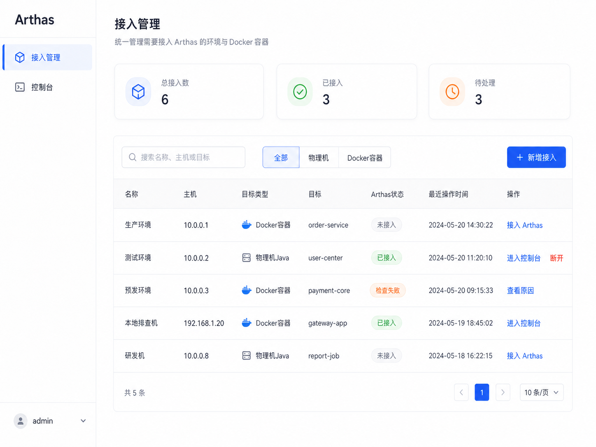
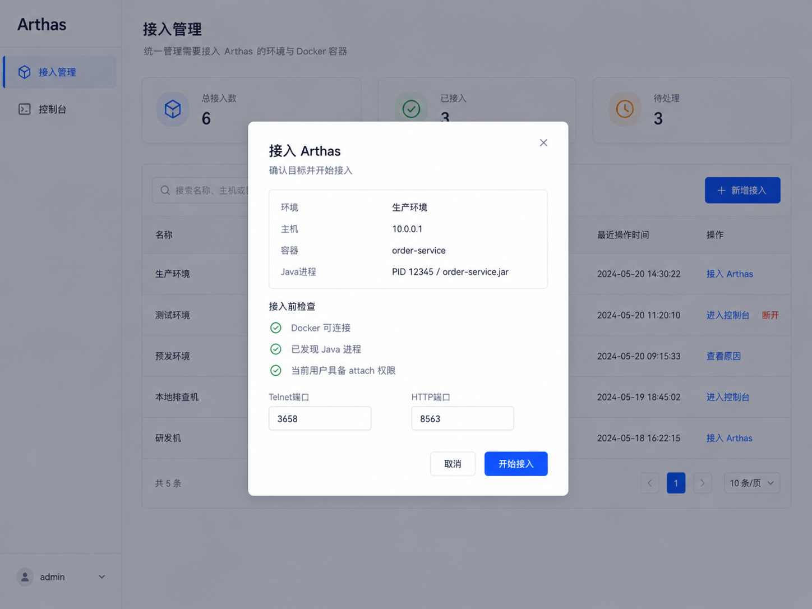
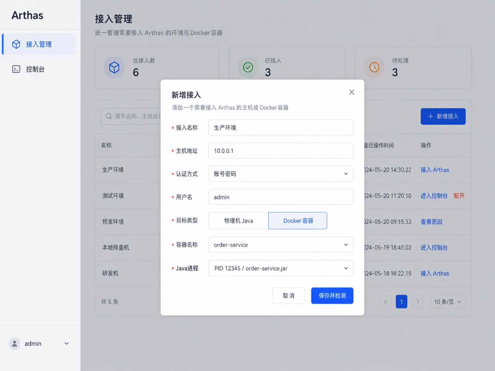
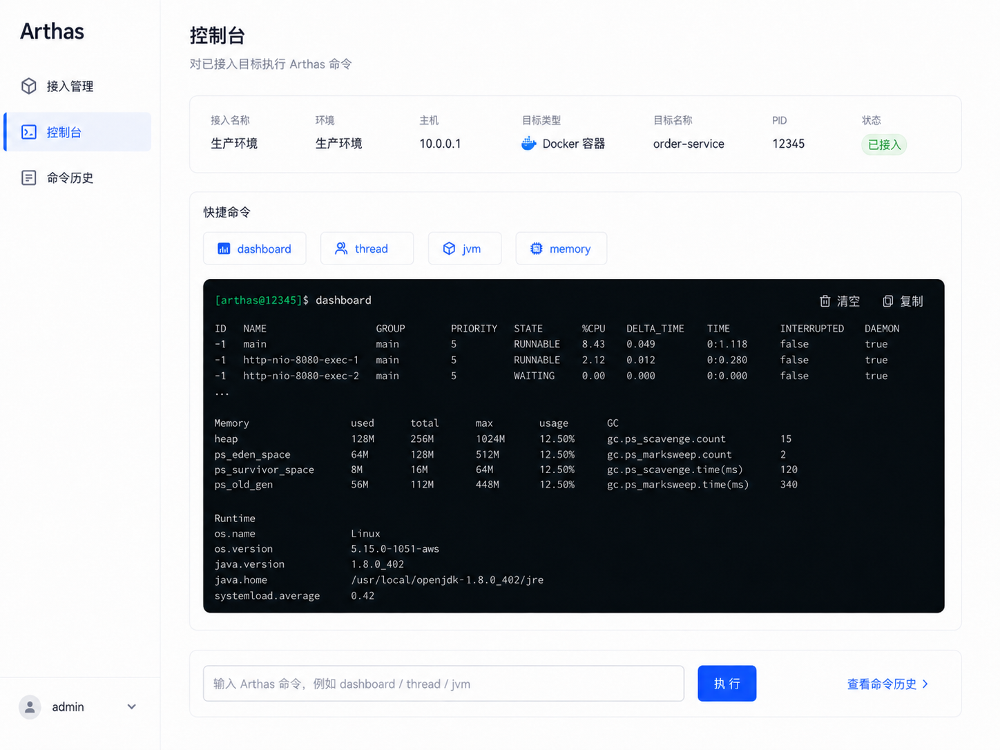
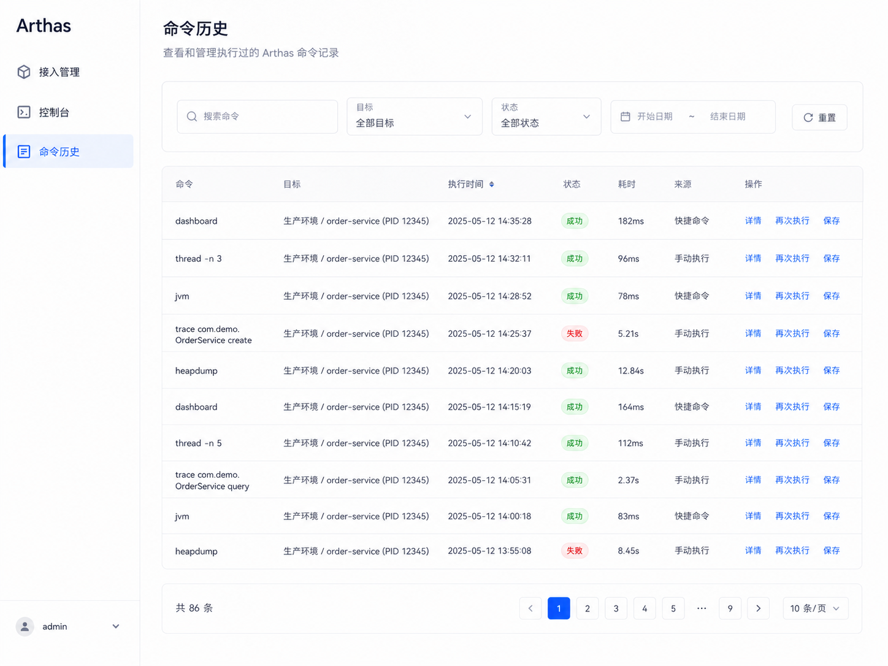
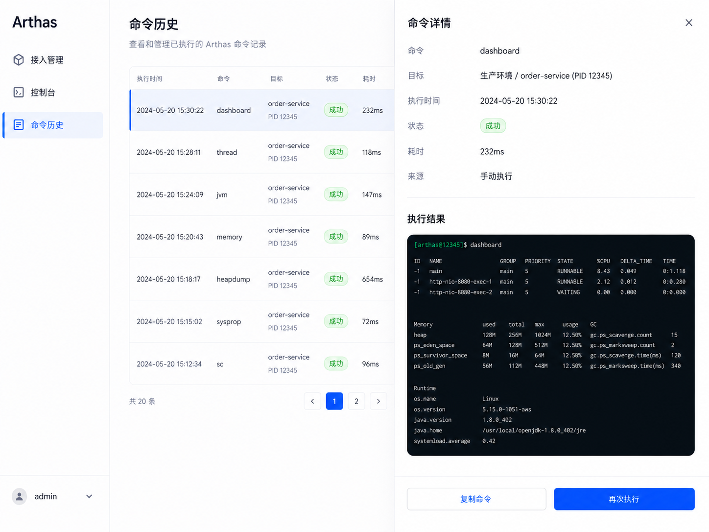
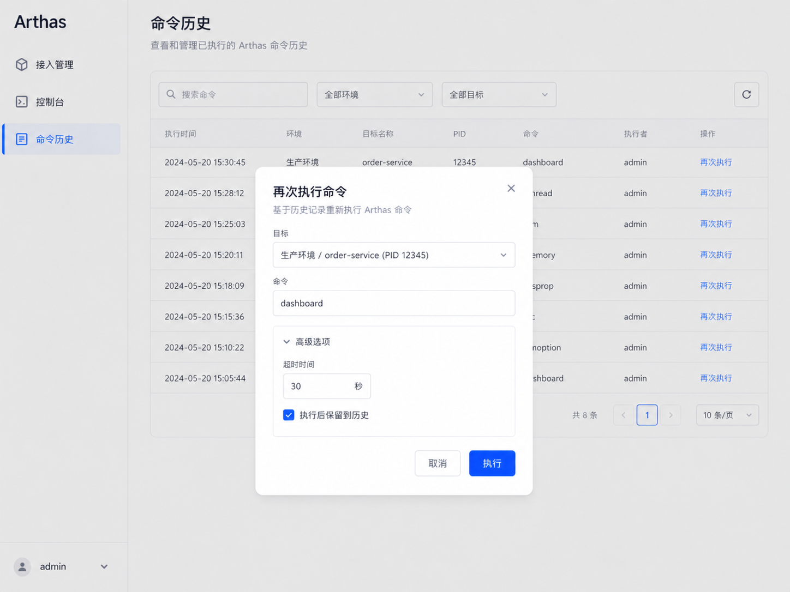
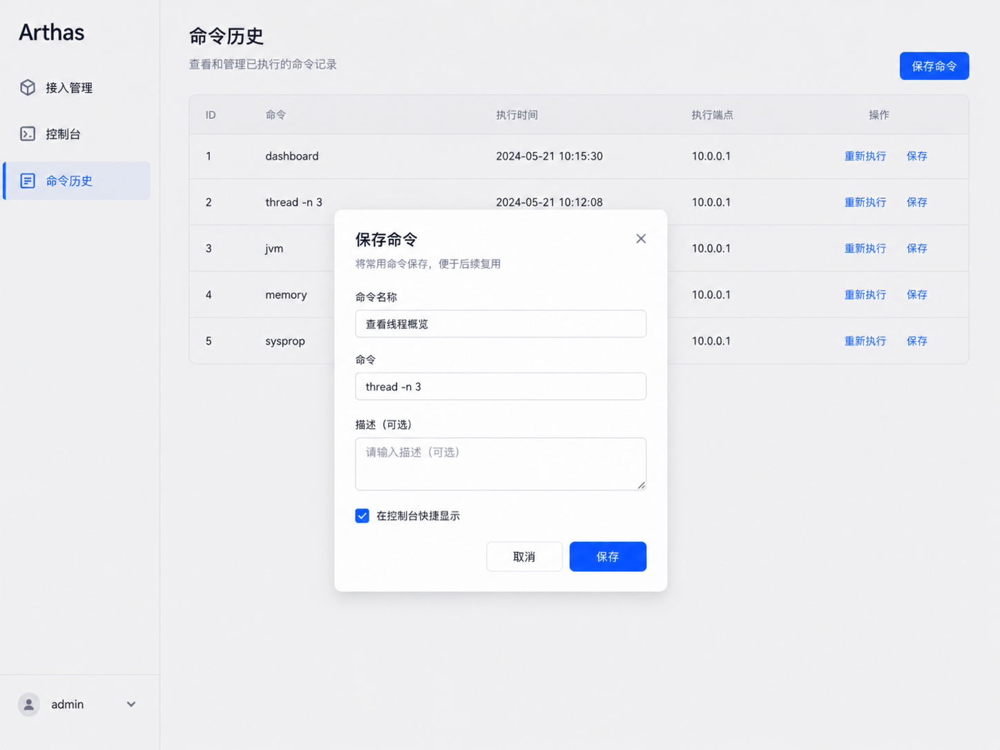

# Fordring 原型说明

当前原型中页面左上角展示的是 `Arthas`。在 Fordring 项目中，可将其视为早期原型标识或模块名；正式产品界面中应按需要替换为 `Fordring`。

## 页面清单

### 1. 接入管理

### 2. 接入 Arthas

### 3. 新增接入

### 4. 控制台

### 5. 命令历史列表

### 6. 命令详情

### 7. 再次执行命令

### 8. 保存命令

