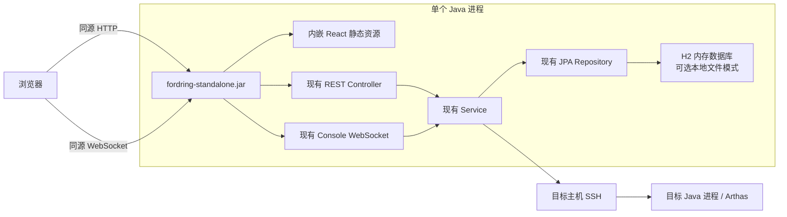

# Fordring 单 JAR 独立部署设计

## 1. 背景

Fordring 当前以 PostgreSQL、后端服务和独立前端服务组成部署环境。仓库中的 `docker-compose.yml` 还保留了 Redis，但当前后端代码没有实际读写 Redis。

新增需求是提供一个独立部署版本：

- 只需要一个 JAR 包即可启动 Fordring。
- 不依赖 PostgreSQL、Redis、Nginx、对象存储或其他外部服务。
- 支持接入管理。
- 支持进入控制台执行 Arthas 命令。
- 支持查看命令历史。
- 支持导出命令历史。
- 必须保存的数据只能写到本地，允许使用内存或文件存储。
- 尽量复用当前代码。
- 不能影响当前 PostgreSQL 部署版本的行为、配置和交付节奏。

本文将这一新增部署形态称为 **standalone 模式**，将当前 PostgreSQL 部署形态称为 **server 模式**。

## 2. 设计目标

### 2.1 必须满足

| 编号 | 目标 | 说明 |
| --- | --- | --- |
| SJ-001 | 单 JAR 启动 | 使用 `java -jar fordring-standalone-{version}.jar` 启动。 |
| SJ-002 | 无外部服务依赖 | 启动和运行不依赖 PostgreSQL、Redis、Nginx 或独立前端服务。 |
| SJ-003 | 功能闭环 | 接入管理、控制台命令执行、命令历史查看和命令历史导出可用。 |
| SJ-004 | 默认临时存储 | 默认使用内存存储，退出 standalone 进程后自动清空接入目标、SSH 凭据和命令历史；需要留档时在退出前导出命令历史。 |
| SJ-005 | 复用当前代码 | 保留现有领域模型、Controller、Service、JPA Repository、WebSocket 和前端页面。 |
| SJ-006 | server 模式零影响 | 默认构建、默认 Spring Profile、PostgreSQL 数据和现有部署方式不变。 |
| SJ-007 | 临时局域网共享 | standalone 允许当前局域网内的其他研发人员通过浏览器访问，不限定为启动机器本机使用；定位为按需启动、调试完成后退出的临时诊断进程。 |
| SJ-008 | Arthas 离线安装 | standalone JAR 内嵌固定版本的完整 `arthas-bin.zip`，目标机器无法访问外网时仍可以安装并接入 Arthas。 |
| SJ-009 | 两类目标接入 | standalone MVP 同时支持物理机 Java 进程和 Docker 容器中的 Java 进程。 |
| SJ-010 | 历史只导出不导入 | standalone MVP 支持查看和导出本次运行产生的命令历史，不开放命令历史导入；server 模式继续保留现有导入能力。 |
| SJ-011 | 会话实例 ID | standalone 每次启动自动生成唯一实例 ID，写入控制台、日志和历史导出包，用于区分不同研发人员和不同临时调试会话。 |

### 2.2 非目标

- 不把 standalone 模式设计成多实例集群。
- 不支持多个 standalone 进程共享同一个本地数据目录。
- 不在本期引入远程数据库、分布式锁或集中式配置中心。
- 不在本期提供操作系统级安装包、内置 JRE 或一键注册系统服务。
- 不在 standalone MVP 承诺 Windows 运行支持。实现尽量保持跨平台，但验收只覆盖 Linux 和 macOS。
- 不在 standalone MVP 承诺 Safari 或 Firefox 兼容性。浏览器验收只覆盖 Chrome 和 Edge 当前主流版本。
- 不改变目标 Java 进程的接入方式。被管理目标仍需满足 SSH、Java 进程和 Arthas 的接入条件。

### 2.3 “单 JAR”的准确含义

standalone 模式的运行前提只有：

1. 一份 `fordring-standalone-{version}.jar`。
2. Java 21 运行环境。
3. 到被管理目标的网络访问能力。
4. 局域网用户到 standalone 服务端口的网络访问能力。

standalone 所在机器不依赖 Node.js、Nginx、Docker CLI、`curl`、`wget` 或其他命令行工具。这些工具只能属于构建环境或被管理目标环境。

JAR 本身保持只读。默认内存模式尝试将日志写到外部数据目录；日志目录不可写时自动降级为仅控制台日志，不阻塞启动。后续显式启用文件模式时，数据库和本地密钥也写到外部数据目录，不能尝试写入 JAR 内部。

启动时检查 Java 系统临时目录是否可写。临时目录不可写时打印警告，但不阻塞启动；后续执行离线 Arthas 安装或使用 SSH Key 时返回明确错误。

目标机器不需要访问公网。standalone 通过 SSH/SFTP 上传内嵌的 Arthas 安装包和 Fordring Arthas HTTP Client。

目标接入前提：

- 物理机 Java 进程：目标主机可通过 SSH 访问，SSH 用户具备目标 Java 进程的 attach 权限。
- Docker 容器 Java 进程：Docker 宿主机可通过 SSH 访问，宿主机已安装 Docker CLI，SSH 用户具备 `docker exec`、`docker cp` 和 `docker inspect` 权限。
- standalone 对物理机和 Docker 目标都通过 SSH 调用目标环境本机 `127.0.0.1:{httpPort}` 的 Arthas HTTP API，不要求额外向局域网暴露 Arthas HTTP 端口。
- 目标环境优先使用已有 `curl` 或 `wget` 调用 Arthas HTTP API；两者都不存在时，复用 JAR 内嵌并上传的 Fordring Arthas HTTP Client，此时目标环境需要可执行 `java -jar`。
- standalone 新启动 Arthas 时将 `--target-ip` 设置为 `127.0.0.1`，避免 Arthas Telnet/HTTP 端口暴露到局域网。server 模式继续保持当前实现。
- Arthas Telnet/HTTP 端口与当前实现保持一致，默认使用 `3658/8563`；端口冲突时由用户在接入表单中手动修改，不自动探测切换。

## 3. 当前代码评估

### 3.1 已有能力可以直接复用

| 功能 | 当前代码 | standalone 复用结论 |
| --- | --- | --- |
| 接入目标增删改查 | `target/AccessTarget*` | 直接复用。 |
| SSH 凭据保存与读取 | `credential/Credential*` | 数据模型可复用，凭据保护方式需要加强。 |
| Java 进程发现 | `discovery/JavaProcessDiscoveryService` | 直接复用。 |
| Arthas 安装、接入和断开 | `arthas/ArthasInstallationService` | 直接复用。 |
| Arthas HTTP 命令执行 | `arthas/ArthasHttpCommandClient` | 直接复用。 |
| 控制台 WebSocket | `websocket/ConsoleWebSocketHandler` | 直接复用。 |
| 命令执行记录与输出分片 | `command/CommandService` | 直接复用。 |
| 命令历史统一查询 | `commandhistory/CommandHistoryQueryService` | 接口复用，SQL 需要兼容 H2。 |
| 命令历史导出 | `commandhistory/CommandHistoryExportService` | 直接复用。 |
| 命令历史导入 | `commandhistory/CommandHistoryImportService` | standalone MVP 不开放；server 模式继续保留。 |
| 常用命令 | `savedcommand/*` | 直接复用。 |
| 审计日志 | `audit/*` | 直接复用。 |
| React 管理台 | `frontend/src/*` | 页面复用，构建时嵌入 JAR。 |

### 3.2 当前阻塞点

| 阻塞点 | 当前表现 | 需要的改造 |
| --- | --- | --- |
| PostgreSQL 是必选启动依赖 | `application.yml` 固定配置 PostgreSQL 数据源。 | standalone Profile 使用嵌入式本地数据库。 |
| Flyway 脚本绑定 PostgreSQL | 使用 `BIGSERIAL`、`TIMESTAMPTZ` 等 PostgreSQL 类型。 | 为 H2 增加独立迁移目录，或将脚本收敛为经验证的公共 SQL。 |
| 统一历史 SQL 绑定 PostgreSQL | `CommandHistoryQueryService` 使用 `NULL::bigint`、`NULL::timestamptz`、`NULL::text`。 | 改为跨数据库 SQL，或按数据库提供查询 Adapter。 |
| 前端独立部署 | 当前由 Nginx 托管 `frontend/dist`。 | standalone 构建将静态资源复制到 JAR 的 `static/`。 |
| 前端默认写死后端地址 | `frontend/src/api.ts` 默认访问 `http://localhost:8080` 和 `ws://localhost:8080`。 | standalone 构建使用同源 REST，并根据浏览器页面地址派生 WebSocket 地址。 |
| SPA 刷新回退由 Nginx 提供 | `frontend/nginx.conf` 使用 `try_files ... /index.html`。 | Spring MVC 增加只服务前端路由的 SPA fallback。 |
| 后续文件模式的凭据保护 | `CredentialService` 使用 `BASE64_DEV_ONLY`。 | standalone MVP 使用内存数据库；后续实现文件模式时再增加本地密钥文件和 AES-GCM。 |
| Arthas 安装依赖目标机器外网 | `ArthasInstallationService` 当前通过目标机器上的 `curl` 或 `wget` 下载 `https://arthas.aliyun.com/arthas-boot.jar`。 | standalone 将固定版本完整 `arthas-bin.zip` 内嵌到 JAR，并通过已有 SSH/SFTP 上传链路离线安装。 |
| 物理机 Arthas HTTP 端口暴露 | `ArthasHttpCommandClient` 当前对物理机目标直接访问 `http://{target.host}:{httpPort}/api`。 | standalone 对物理机目标也通过 SSH 在目标主机本地访问 `127.0.0.1:{httpPort}`；server 模式保持现状。 |
| 复用已有 Arthas 时未校验目标 PID | 当前 attach 探活只调用 Arthas HTTP API 的 `version`，端口上的 Arthas 可用就返回 `ATTACHED_ALREADY`，没有确认它是否属于用户选择的 Java PID。 | 同一目标环境诊断多个 JVM 时存在连错进程风险。开始实现 standalone 骨架不受影响，但发布前需要补充目标 PID 校验，或明确限制同一目标环境同时只诊断一个 JVM。 |

### 3.3 Redis 结论

Redis 当前只存在于 `docker-compose.yml`、`README.md` 和早期设计文档中。后端代码没有 Redis 客户端依赖，也没有 Redis 调用。

standalone 模式不需要引入 Redis 替代品。当前运行中命令由 `CommandExecutionRunner.runningTasks` 在进程内维护，符合单进程 standalone 的运行模型。

## 4. 方案对比

### 4.1 存储方案

| 方案 | 优点 | 缺点 | 结论 |
| --- | --- | --- | --- |
| H2 文件数据库 | 仍使用 JDBC、JPA、事务和 Flyway；查询、分页、唯一约束和级联删除可保留；单 JAR 可内嵌驱动。 | 需要处理 SQL 方言差异；退出后保留 SSH 凭据和输出；不适合多进程共享数据文件。 | 保留为后续演进设计，standalone MVP 暂不实现。 |
| H2 内存数据库 | 实现成本低，启动后不写业务数据库文件；退出后自动清理目标、凭据和历史。 | 重启丢失接入目标、凭据、命令历史、常用命令和审计日志。 | **推荐作为默认方案。** |
| JSON 文件存储 | 文件直观，可手工查看。 | 需要重写 Repository、索引、分页、事务、并发写入、级联删除和唯一约束；命令输出分片会增加复杂度。 | 不推荐。 |
| SQLite 文件数据库 | 单文件存储成熟。 | 当前 Spring Data JPA、Hibernate 和 Flyway 组合需要额外方言适配；与现有模型的复用程度低于 H2。 | 暂不选择。 |

### 4.2 前端交付方案

| 方案 | 优点 | 缺点 | 结论 |
| --- | --- | --- | --- |
| 将 React 构建结果嵌入 JAR | 运行时只有一个端口和一个进程；不依赖 Nginx。 | 需要增加构建编排和 SPA fallback。 | **推荐。** |
| 启动时释放前端文件并另起静态服务 | 可以复用 Nginx 风格目录。 | 增加进程管理、端口和临时文件清理问题。 | 不推荐。 |
| 保留独立前端服务 | 无需改构建。 | 不满足单 JAR。 | 排除。 |

## 5. 推荐架构



本方案不新建一套业务实现。standalone 是现有模块化单体的第二种交付方式：

- server 模式：独立前端 + Spring Boot 后端 + PostgreSQL。
- standalone MVP：内嵌前端 + Spring Boot 后端 + H2 内存数据库。
- 后续演进：可按本节保留的设计增加 H2 文件模式。

## 6. 核心设计决策

### 6.1 独立构建产物

新增 standalone 构建入口，显式产出：

```text
fordring-standalone-{version}.jar
```

standalone 是按需构建的独立发布产物。默认 server 构建与发布流程不顺带生成 standalone JAR；只有显式执行 standalone release 流水线时才产出它。

standalone JAR 版本号跟随 Fordring 代码版本，不引入独立版本体系。构建元信息额外记录内嵌 Arthas 版本 `4.2.0`。

现有默认构建继续产出：

```text
fordring-backend-{version}.jar
```

建议使用 Maven Profile 或独立 Maven Module 组织构建。无论采用哪一种方式，都必须满足：

- 默认执行 `mvn package` 时，server 模式依赖和产物行为不变。
- 只有显式执行 standalone 构建时才加入 H2 驱动、standalone 配置和前端静态资源。
- standalone JAR 不要求 PostgreSQL JDBC Driver 在运行时生效。
- 两个产物可以从同一份业务源码构建。

推荐命令形态：

```bash
cd backend
mvn -Pstandalone clean package
```

前端构建可以由 standalone Profile 编排，也可以由仓库级脚本先执行：

```bash
cd frontend
npm ci
npm run build
```

随后将 `frontend/dist/**` 复制到 standalone JAR 的：

```text
BOOT-INF/classes/static/
```

release 流程必须从前端源码执行干净构建，再将产物嵌入 standalone JAR。不能依赖源码仓库中预先存在的 `frontend/dist`，也不能复用开发者工作区中的陈旧静态资源。

### 6.2 Spring Profile 隔离

保留当前 `application.yml` 作为 server 模式默认配置。新增：

```text
backend/src/standalone/resources/application-standalone.yml
```

standalone JAR 启动时默认激活 `standalone` Profile。server 模式仍使用当前 PostgreSQL 配置，不需要修改原有启动参数。

为了保证最小启动命令不需要额外添加 `--spring.profiles.active=standalone`，建议增加 standalone 专用启动类：

```text
FordringStandaloneApplication
```

该启动类调用 Spring Boot 时设置默认 Profile 为 `standalone`。standalone 构建产物将它配置为启动类。现有 server 模式 JAR 继续使用：

```text
FordringApplication
```

这样两个 JAR 的默认运行行为由各自启动类决定，不依赖操作者记忆启动参数，也不会让 standalone 配置进入 server 模式默认路径。

standalone 配置示例：

```yaml
server:
  address: 0.0.0.0
  port: 8080

spring:
  datasource:
    url: jdbc:h2:mem:fordring;MODE=PostgreSQL;DATABASE_TO_LOWER=TRUE;DEFAULT_NULL_ORDERING=HIGH;DB_CLOSE_DELAY=-1
    username: sa
    password:
  flyway:
    locations: classpath:db/migration-h2

fordring:
  standalone:
    enabled: true
    data-dir: ${FORDRING_DATA_DIR:./fordring-data}
    storage-mode: memory
```

`MODE=PostgreSQL` 只能减少方言差异，不能代替测试。迁移脚本和历史查询仍需在 H2 集成测试中验证。`DB_CLOSE_DELAY=-1` 确保连接池临时释放全部连接时，当前进程内的内存数据库仍然保留到 JVM 退出。

standalone 启动时覆盖默认 `fordring.instance.id`，自动生成本次会话唯一 ID：

```text
standalone-{hostname}-{yyyyMMddHHmmss}-{random}
```

规则：

- 实例 ID 每次启动重新生成，不跨重启保存。
- 实例 ID 打印到控制台和日志。
- 命令历史导出包使用该实例 ID 作为来源环境 ID。
- 用户显式配置 `FORDRING_INSTANCE_ID` 时允许覆盖自动生成值，便于特殊排障场景。
- 实例名称默认使用 `standalone-{hostname}`，写入导出包来源环境名称。
- 用户显式配置 `FORDRING_INSTANCE_NAME` 时允许覆盖默认实例名称。

### 6.3 本地数据目录

默认数据目录：

```text
./fordring-data/
```

该路径相对于启动 standalone 时的当前工作目录。MVP 默认日志目录为：

```text
./fordring-data/logs
```

允许通过环境变量覆盖：

```bash
FORDRING_DATA_DIR=/opt/fordring/data \
java -jar fordring-standalone-0.1.0.jar
```

目录建议：

```text
fordring-data/
  logs/
    fordring.log
  db/                            # 仅文件模式
    fordring.mv.db
  secrets/                       # 仅文件模式
    credential-master-key
```

约束：

- 启动时尝试自动创建日志目录。
- 日志目录无法创建或不可写时，打印警告并降级为仅控制台日志，不能阻塞启动。
- 后续文件模式需要单独要求可写数据目录和单进程文件锁。
- 文件模式下，本地数据库文件和密钥文件需要一起备份。
- 默认内存模式也允许日志写入 `${FORDRING_DATA_DIR}/logs`。
- 日志必须按日期和大小滚动，并配置保留天数和总大小上限。
- standalone 默认日志上限：单文件最大 `20 MB`、最多保留 `7 天`、归档日志总计最多 `200 MB`。
- 日志可能包含目标地址、用户名、命令预览、错误信息和部分输出预览，交付说明需要提示用户按调试数据管理。
- standalone MVP 不提供退出时自动删除本地日志的选项。需要立即清理时，由用户自行删除日志目录。

### 6.4 内存模式与后续文件模式

默认值：

```text
fordring.standalone.storage-mode=memory
```

内存模式使用：

```text
jdbc:h2:mem:fordring
```

内存模式规则：

- 退出进程后自动清空接入目标、SSH 凭据、命令历史、输出分片、常用命令和审计日志。
- SSH 凭据允许在当前 standalone 进程生命周期内保存到 H2 内存数据库，供发现、安装、接入、命令执行和 detach 复用。
- 常用命令与当前实现保持一致，允许在当前进程生命周期内保存和复用，退出后随 H2 内存数据库清空。
- 审计日志表与当前实现保持一致，保留在 H2 内存数据库中；退出后清空。滚动文件日志仍按本地日志策略保留基础排障信息。
- 用户需要保留调试记录时，应在退出进程前导出命令历史。
- 导出与当前实现保持一致，固定包含命令输出；导出前必须提示输出可能包含业务数据、Token、堆栈或其他敏感信息。

以下文件模式设计保留供后续实现参考，**不属于 standalone MVP 实施与验收范围**。

显式文件模式：

```bash
java -jar fordring-standalone-0.1.0.jar \
  --fordring.standalone.storage-mode=file
```

文件模式使用：

```text
jdbc:h2:file:${fordring.standalone.data-dir}/db/fordring
```

文件模式保存：

- 接入目标。
- SSH 凭据。
- 命令执行记录。
- 命令输出分片。
- 常用命令。
- 审计日志。

文件模式需要打印“本地会保留 SSH 凭据和命令输出”的提示，并使用本地密钥文件保护凭据。

### 6.5 数据库迁移

建议保留现有 PostgreSQL 迁移目录，并为 H2 新增独立目录：

```text
backend/src/main/resources/db/migration/
backend/src/standalone/resources/db/migration-h2/
```

现有 `db/migration/` 和 `application.yml` 不需要移动或改名。standalone Profile 显式使用 `db/migration-h2/`，避免 H2 脚本进入 server 模式默认扫描路径。

需要覆盖的表：

- `credential_secret`
- `credential_master_key`
- `access_target`
- `command_execution`
- `command_output_chunk`
- `saved_command`
- `audit_log`
- `command_history_import_batch`
- `imported_command_history`
- `imported_command_output_chunk`

standalone MVP 虽然禁用历史导入 API，但 H2 migration 仍保留导入相关三张空表。现有统一历史查询、JPA 实体和 Repository 继续复用，不为了隐藏导入入口额外拆分持久化模型。standalone 不会向这些表写入数据。

H2 迁移需要重点验证：

- 自增主键。
- 时间类型。
- 布尔类型。
- 唯一索引。
- 外键和 `ON DELETE CASCADE`。
- 大文本字段。
- migration version 与 PostgreSQL 版本一一对应。

H2 内存数据库每次启动都从空库初始化。Flyway migration 失败时 standalone 必须启动失败，不能以缺表或部分初始化状态继续运行。

### 6.6 历史查询 SQL 兼容

`CommandHistoryQueryService` 当前使用 PostgreSQL 专属 cast：

```sql
NULL::bigint
NULL::timestamptz
NULL::text
```

优先将其改为跨数据库 SQL：

```sql
CAST(NULL AS BIGINT)
CAST(NULL AS TIMESTAMP WITH TIME ZONE)
CAST(NULL AS VARCHAR)
```

如果 H2 和 PostgreSQL 在联合查询、分页或时间类型上仍存在不可消除的差异，再引入一个小型查询 Adapter：

```text
CommandHistoryListQuery
  PostgreSqlCommandHistoryListQuery
  H2CommandHistoryListQuery
```

只有确认存在两套 SQL 后再增加这个 seam。其余 Service 和 DTO 不需要感知数据库类型。

### 6.7 内嵌前端

standalone JAR 直接提供：

```text
GET /
GET /assets/**
GET /access
GET /console
GET /console/{targetId}
GET /commands
```

前端路由由 React Router 处理。Spring MVC 需要为不存在的前端页面路径回退到 `index.html`，但不能拦截：

```text
/api/**
/ws/**
/assets/**
/error
```

前端 REST 基础地址建议调整为：

```text
默认使用相对路径
```

WebSocket 基础地址建议由页面地址派生：

```text
http  -> ws
https -> wss
```

server 模式仍可通过 `VITE_FORDRING_API_BASE_URL` 和 `VITE_FORDRING_WS_BASE_URL` 显式覆盖地址。

standalone 前端、REST API 和 WebSocket 使用同一个服务端口：

- REST API 不需要额外开放跨域来源。
- WebSocket 接受当前页面的同源 Origin。
- 不使用 `*` 放开任意跨域 Origin。
- standalone 后端需要校验浏览器请求携带的 `Origin`：只接受与当前 standalone 服务地址同源的值，拒绝第三方网页发起的跨域 REST 和 WebSocket 请求。不能只依赖前端相对路径形成约束。
- 不携带 `Origin` 的直接 API 请求继续允许访问，便于研发使用 `curl`、Postman 等工具临时排障。`Origin` 校验用于降低浏览器跨站误操作风险，不构成身份认证或 API 鉴权。
- server 模式继续保留现有可配置 CORS 行为。

前端构建增加模式标志：

```text
VITE_FORDRING_MODE=server
VITE_FORDRING_MODE=standalone
```

- server 前端构建默认使用 `server`，显示现有导入入口。
- standalone JAR 内嵌前端使用 `standalone` 构建，隐藏导入入口。
- 不在浏览器运行时猜测部署模式。

### 6.8 后续文件模式的凭据本地保护

standalone MVP 使用 H2 内存模式，退出后 SSH 密码或 SSH Key 自动清空。后续文件模式会在本地保存 SSH 密码或 SSH Key；当前 `BASE64_DEV_ONLY` 只能编码，不能提供安全保护，不应作为正式文件模式方案。

建议 standalone 增加本地密钥文件：

```text
fordring-data/secrets/credential-master-key
```

规则：

- 首次启动自动生成随机主密钥。
- 使用 AES-GCM 加密凭据。
- 密钥文件权限尽可能限制为仅启动用户可读写。
- 日志、导出包和 API 响应禁止输出明文凭据。
- 数据库文件和密钥文件分开存放，但备份时必须成对备份。
- 如果无法设置安全权限，打印明确警告。

这项改造可以做成 `CredentialCipher` seam：

```text
CredentialCipher
  DevBase64CredentialCipher
  LocalAesGcmCredentialCipher
```

server 模式先继续使用现有行为，避免 standalone 需求顺带扩大现有部署版本的改造范围。后续可以单独推动 server 模式切换 KMS、Vault 或环境变量密钥。

### 6.9 单进程运行模型

standalone 只有一个 Java 进程：

- WebSocket 会话保存在内存。
- 运行中的命令任务保存在内存。
- 停止命令通过当前 `runningTasks` 处理。
- 与当前实现保持一致，不增加单目标命令互斥；同一个目标可能并发执行多条命令。
- standalone 增加全局运行中命令数量上限，默认最多 `20` 条。达到上限时拒绝新命令并返回明确提示。
- 全局运行中命令数量需要使用原子计数或信号量预占名额，不能使用非原子的“先统计再启动”，避免并发请求突破上限。
- 全局上限允许通过 `--fordring.command.max-running-executions=20` 调整，不提供页面配置。
- 单条命令输出落库大小继续复用当前限制，默认最多保存 `1 MB`；超过后标记截断，但实时输出行为保持当前实现。
- standalone 内存模式最多保留最近 `1000` 条终态命令历史。超过后删除最旧终态记录及其输出分片，不能删除仍在运行的记录。
- 历史记录上限允许通过 `--fordring.command-history.max-local-records=1000` 调整，不提供页面配置。
- 每次命令进入终态后执行历史清理，按执行时间从旧到新删除超出上限的终态记录。
- standalone 最多保存 `100` 个接入目标。达到上限时拒绝新增目标并返回明确提示。
- 接入目标上限允许通过 `--fordring.access.max-targets=100` 调整，不提供页面配置。
- 不需要分布式锁。
- 不需要 Redis。
- 不增加多个 standalone 进程之间的目标锁、租约或状态同步。多个 standalone 进程同时操作同一个目标时，可能相互影响 attach、detach 和命令执行结果；研发临时调试时需要避免这样使用。
- 与当前实现保持一致，浏览器关闭、刷新或 WebSocket 短暂断开时不自动停止已经提交的命令。命令继续在后端运行并写入历史；页面断开期间不补发实时输出，用户可以在历史中查看最终结果。

standalone 正常退出时需要尽力清理目标环境：

1. 拒绝新的 attach 和命令执行请求。
2. 停止仍在运行的命令。
3. 对本次 standalone 会话主动 attach 成功的目标执行 Arthas detach。
4. 为整个清理过程设置 `15 秒` 总超时，避免退出永久阻塞。
5. 清理失败时打印未成功 detach 的目标清单，然后继续退出。

`Ctrl+C`、正常 `SIGTERM` 和 JVM 正常关闭会触发退出清理。`kill -9`、宿主机掉电或 JVM 崩溃时无法保证执行自动 detach。启动提示和交付说明需要明确这一点。

退出清理必须区分 Arthas 所有权：

- 本次 standalone 会话主动 attach 成功的目标：退出时自动 detach。
- 接入前已经存在可用 Arthas、当前会话只复用连接的目标：退出时不 detach。
- 所有权状态只需要保存在当前进程内，不落盘。
- standalone 接入逻辑需要将当前脚本返回的 `ATTACHED` 与 `ATTACHED_ALREADY` 解析为明确的接入结果：只有 `ATTACHED` 记为当前会话主动 attach，`ATTACHED_ALREADY` 记为复用已有 Arthas。

目标已有可用 Arthas 时的默认行为：

- 默认直接复用已有 Arthas，不执行 stop，不重新 attach。
- 复用连接不改变 Arthas 所有权，standalone 退出时不 detach。
- 与当前前端保持一致，不新增“强制重启”按钮。
- 目标状态为 `DISCONNECTED` 或 `ATTACH_FAILED` 后，用户点击“重新接入 Arthas”时自动 stop 已有 Arthas，并使用 standalone 固定版本重新 attach。
- 重新接入成功后由本次 standalone 会话接管生命周期，正常退出时自动 detach。

正常退出不删除目标机器或 Docker 容器中已上传的文件和日志，包括但不限于：

- `~/.arthas/arthas-boot.jar`
- `/tmp/fordring-arthas-http-client.jar`
- `/tmp/fordring-arthas-{pid}.log`

这些文件会保留在目标环境中，方便后续再次接入。交付说明需要提示远端残留行为。

后续文件模式启动后如果进程异常退出：

- 已写入 H2 的历史记录和输出分片保留。
- 内存中的实时 WebSocket 会话丢失。
- 上次退出时仍为 `RUNNING` 的命令记录需要在下次启动时修正为 `FAILED` 或新增 `INTERRUPTED` 状态。
- 目标 `ATTACHED` 状态可能过期，进入控制台或执行命令前仍应实时校验。

### 6.10 临时局域网共享与访问保护

standalone 定位为研发临时调试工具：

- 由研发人员按需启动。
- 允许同一受控局域网内的其他研发人员访问。
- 默认监听 `0.0.0.0`，允许局域网用户访问。
- 只需要本机访问时，可以显式配置 `--server.address=127.0.0.1` 收紧监听范围。
- 调试完成后退出 standalone 进程。
- 与当前 server 模式保持一致，不增加应用内登录。
- 不增加 HTTPS，浏览器通过 HTTP 和 WebSocket 明文访问。
- 所有操作仍按单用户模式记录为默认操作者 `admin`。
- 不要求局域网用户填写临时昵称；`admin` 仅表示默认操作者，不构成个人身份审计。
- 不增加只读访客、操作员或管理员权限区分。任何能够访问 standalone URL 的用户都拥有完整操作权限。
- 默认内存模式退出后自动清空接入目标、SSH 凭据和命令历史。
- 需要留档时，用户在退出进程前主动导出命令历史。
- 正常退出时不自动导出命令历史，避免无意将敏感输出写入本地文件。
- 日志仍会滚动写入本地文件，退出进程不会立即删除日志。

无登录和无 HTTPS 会带来明确风险：

- 任何能访问 standalone 监听端口的人都可以管理 SSH 凭据、接入目标、执行 Arthas 命令、查看和导出命令历史。
- standalone URL 等价于完整操作权限，不能转发给不可信用户。
- `curl`、Postman 等不携带浏览器 `Origin` 的直接 API 请求仍可访问完整功能；同源限制不能替代网络隔离。
- 浏览器提交的 SSH 密码或私钥会通过局域网明文传输。
- SSH Key 认证与当前实现保持一致：私钥除通过局域网明文传输外，还会在 standalone 宿主机系统临时目录短暂落盘，用于建立 SSH 连接后删除。
- 控制台命令、命令输出和导出操作也会通过局域网明文传输。
- SSH 连接与当前代码保持一致，接受任意目标主机指纹，不提供主机身份校验。

standalone 只能用于受控研发网络，不能直接暴露到公网、不可信网络、允许网络嗅探的共享网络，或存在 SSH 中间人风险的网络。

启动时应打印醒目提示：

```text
WARNING: Fordring standalone is running without application login.
HTTP and WebSocket traffic are not encrypted.
Only expose this port inside a trusted development network.
Stop the process after diagnostics are complete.
```

README 和交付说明必须给出相同警告。应用内登录、个人账号和权限体系如果后续需要，应另立需求。

standalone MVP 前端除隐藏命令历史“导入”按钮外，与当前实现保持一致，不新增横幅、模式标识或额外提示效果。风险提示集中在启动控制台、日志和交付说明。

standalone 不提供网页“退出服务”按钮或远程 shutdown API。只允许启动进程的研发人员在宿主机通过 `Ctrl+C` 或 `SIGTERM` 触发正常退出清理。

### 6.11 Arthas 离线安装

standalone JAR 内嵌一个经过验证的固定版本：

```text
BOOT-INF/classes/tools/arthas-bin.zip
```

standalone MVP 固定使用 Arthas `4.2.0`。后续如需升级，单独确认升级需求并更新版本与 SHA-256，不允许构建时自动漂移到最新版本。

安装流程：

1. 检查目标环境是否已经存在可用的 `arthas-boot.jar`。
2. 目标已有可用 Arthas 时直接复用，即使版本不是 `4.2.0` 也不主动覆盖。
3. 目标未安装 Arthas、已有 Arthas 不可用，或目标状态为 `DISCONNECTED`、`ATTACH_FAILED` 后重新接入时，使用 standalone 固定版本。
4. 重新接入场景先执行 stop；stop 失败则拒绝覆盖并提示用户处理。
5. 从 standalone JAR 读取内嵌完整 ZIP 资源并覆盖目标环境版本。
6. 通过已有 `TargetShellExecutor.upload` 使用 SSH/SFTP 上传到目标主机临时路径。
7. Docker 目标继续复用已有 `docker cp` 流程复制到容器内。
8. 使用随 JAR 内嵌的 Fordring Arthas HTTP Client 校验上传后的 ZIP SHA-256，并通过目标 JVM 安全解压；不依赖目标环境提供 `unzip`、`sha256sum` 或 `shasum`。
9. 校验解压后的 `arthas-boot.jar`，覆盖目标环境的 `~/.arthas/` Arthas 运行文件后执行接入。
10. 无论是新安装还是复用已有 Arthas，都确保目标环境存在 Fordring Arthas HTTP Client，供缺少 `curl`、`wget` 时调用本地 Arthas HTTP API。

约束：

- 目标机器不需要访问公网。
- 内嵌 Arthas 版本固定为 `4.2.0`，SHA-256 必须在构建配置中固定。
- 构建和发布说明需要记录 Arthas 版本。
- 目标环境中已有可用 Arthas 时优先复用，不因版本不同主动覆盖。
- 目标未安装、已有 Arthas 不可用，或 `DISCONNECTED`、`ATTACH_FAILED` 后重新接入时，以 standalone 内嵌版本为准并覆盖。
- JAR 体积增加是可接受的交付成本。
- standalone 安装逻辑只走离线上传，彻底禁用公网下载。
- server 模式保留当前在线下载行为，避免影响现有部署。
- 物理机目标通过 SSH/SFTP 上传到目标主机。
- Docker 目标通过 SSH/SFTP 上传到宿主机，再复用 `docker cp` 复制到容器内。
- standalone 命令执行时，物理机和 Docker 目标都通过 SSH 调用目标环境本机 Arthas HTTP API。
- Fordring Arthas HTTP Client fallback 需要覆盖 attach 探活、detach 和命令执行，不能只覆盖控制台命令执行。
- `arthas-bin.zip` 不提交到源码仓库。
- release 流程从公开 Arthas 下载地址获取固定版本 `4.2.0` 的完整 `arthas-bin.zip`，校验 SHA-256 后再嵌入 standalone JAR。
- 下载不需要登录；下载失败或校验失败时必须立即失败。
- Arthas 升级需要单独确认需求，不能在 release 构建时自动使用最新版本。
- standalone release 构建缺少 Arthas 包或校验失败时必须立即失败，不能产出不完整制品。
- 开发环境可以显式指定本地 Arthas 包路径进行构建，但仍必须校验固定 SHA-256。

## 7. 与 server 模式的隔离

### 7.1 不变项

server 模式保持：

- 当前 PostgreSQL 数据源。
- 当前默认 Spring Profile。
- 当前 Docker Compose 启动方式。
- 当前独立前端容器。
- 当前 REST API。
- 当前 WebSocket 协议。
- 当前 PostgreSQL 表结构和数据。

### 7.2 standalone 专属项

standalone 新增：

- `fordring-standalone-{version}.jar`
- `application-standalone.yml`
- H2 runtime dependency
- H2 Flyway migration
- 内嵌 React 静态资源
- SPA fallback
- 默认内存模式
- 后续文件模式、本地数据目录初始化和本地密钥文件设计，MVP 暂不实现
- 临时局域网共享风险提示
- 明文 HTTP 和 WebSocket 风险提示
- 内嵌固定版本 Arthas 安装包和离线上传
- standalone 前端隐藏导入入口，后端禁用导入 API

### 7.3 共享项

两个模式共享：

- 领域实体。
- Controller。
- Service。
- JPA Repository。
- 命令历史导出归档格式。
- 前端源码。
- API 类型。
- WebSocket 协议。

## 8. 代码改造建议

### 8.1 建议新增

```text
backend/src/main/java/com/fordring/standalone/
  FordringStandaloneApplication.java
  StandaloneDataDirectoryInitializer.java
  StandaloneShutdownCleaner.java
  StandaloneSpaController.java
  StandaloneArthasPackageProvider.java

backend/src/standalone/resources/
  application-standalone.yml
  db/migration-h2/
```

`tools/arthas-bin.zip` 是 release 构建阶段从公开 Arthas 下载地址获取、校验固定 SHA-256 后注入到 JAR 的完整离线资源，不提交到源码仓库。release 完成后可以将最终 standalone JAR 保存到制品仓库。

如果历史查询无法使用公共 SQL，再新增：

```text
backend/src/main/java/com/fordring/commandhistory/
  CommandHistoryListQuery.java
  PostgreSqlCommandHistoryListQuery.java
  H2CommandHistoryListQuery.java
```

### 8.2 建议调整

| 文件或模块 | 调整 |
| --- | --- |
| `backend/pom.xml` | 增加 standalone 构建入口、H2 runtime dependency、standalone 启动类和前端资源打包。 |
| `CommandHistoryQueryService` | 优先替换 PostgreSQL 专属 cast；必要时委托查询 Adapter。 |
| `frontend/src/api.ts` | 支持同源 REST 和从页面地址派生 WebSocket 地址。 |
| `frontend/src/pages/CommandsPage.tsx` | 根据 `VITE_FORDRING_MODE` 在 standalone 构建中隐藏命令历史导入入口。 |
| Web MVC 配置 | standalone 模式下增加 SPA fallback。 |
| WebSocket Origin 配置 | standalone 允许来自当前服务局域网地址的同源 WebSocket 连接，不能继续固定为 `http://localhost:5173`。 |
| `CommandHistoryImportController` | standalone Profile 下不注册 Controller，调用导入 API 返回 `404`；server 模式照常注册。 |
| 日志配置 | standalone 默认将日志写到 `${FORDRING_DATA_DIR}/logs`。 |
| 启动日志 | standalone 启动时打印无登录、无 HTTPS 和仅限受控研发网络的风险提示。 |
| `ArthasInstallationService` | standalone 优先从 JAR 读取固定版本 Arthas 安装包，并通过 SSH/SFTP 离线上传；新启动 Arthas 时使用 `--target-ip 127.0.0.1`；HTTP Client fallback 覆盖探活和 detach；解析 `ATTACHED` 与 `ATTACHED_ALREADY` 供退出清理判断所有权。 |
| `ArthasHttpCommandClient` | standalone 对物理机和 Docker 目标统一通过 SSH 调用目标环境本机 Arthas HTTP API。 |
| `CommandExecutionRunner` | standalone 增加全局运行中命令数量上限，默认 `20`；达到上限时拒绝新命令。 |
| release 流程 | 从公开 Arthas 下载地址下载固定版本 `4.2.0`，校验 SHA-256，下载失败、缺包或校验失败时阻止发布。 |
| 退出清理 | standalone 正常退出时停止运行中命令，并尽力 detach 本次会话主动 attach 的目标。 |

### 8.3 不建议调整

- 不要复制一套 standalone Controller。
- 不要复制一套 standalone Service。
- 不要使用 JSON 文件替代现有 Repository。
- 不要把 H2 配置写进 server 模式默认启动路径。
- 不要为了 standalone 把所有持久化一次性抽象成自定义 Repository。

## 9. 启动与运维

### 9.1 最小启动命令

```bash
java -jar fordring-standalone-0.1.0.jar
```

standalone 以零外部配置为默认使用方式。常规临时调试只需要 JAR 和上述启动命令，不要求用户准备 YAML、环境变量或启动脚本。

默认监听地址：

```text
0.0.0.0:8080
```

未显式配置 `--server.port` 时，standalone 在 `8080-8099` 范围内寻找空闲端口。`8080` 被占用时依次尝试 `8081`、`8082` 等端口。全部占用时启动失败，并提示用户显式配置 `--server.port`。用户显式配置 `--server.port` 时严格使用指定端口，端口冲突则启动失败。

启动时需要将最终监听端口和枚举得到的局域网访问地址同时打印到控制台与日志，例如：

```text
Fordring standalone listening on 0.0.0.0:8081
Fordring standalone instance id: standalone-devbox-20260601103000-a1b2
Fordring standalone instance name: standalone-devbox
http://127.0.0.1:8081
http://192.168.1.20:8081
```

地址枚举规则：

- 始终打印 `http://127.0.0.1:{port}`。
- 打印全部非回环 IPv4 地址。
- 不尝试自动过滤 VPN、虚拟网卡或 Docker bridge，避免误判。
- 暂不打印 IPv6 地址。

只允许本机访问：

```bash
java -jar fordring-standalone-0.1.0.jar \
  --server.address=127.0.0.1
```

### 9.2 指定端口

```bash
java -jar fordring-standalone-0.1.0.jar \
  --server.port=18080
```

standalone 保留 Spring Boot 原生外部配置能力，用于少量特殊排障场景，但不新增 standalone 专用配置格式，也不将外部配置文件作为启动依赖。例如：

```bash
java -jar fordring-standalone-0.1.0.jar \
  --spring.config.additional-location=./custom.yml
```

README 和交付说明以零配置启动命令为主，外部配置能力仅作为高级用法说明。

### 9.3 后续文件模式运维参考

以下内容不属于 MVP。后续实现文件模式后，停止进程再备份：

```text
fordring-data/db/
fordring-data/secrets/
```

日志目录可以按运维要求单独归档。

### 9.4 后续文件模式升级参考

以下内容不属于 MVP。后续实现文件模式后，升级步骤：

1. 停止旧进程。
2. 备份 `db/` 和 `secrets/`。
3. 替换 JAR。
4. 启动新 JAR。
5. 由 Flyway 自动执行 H2 migration。
6. 验证接入目标、历史列表和导出。

禁止两个不同版本的 standalone JAR 同时访问同一个数据目录。

## 10. 实施阶段

### 阶段一：跑通单 JAR 闭环

1. 新增 standalone 构建产物。
2. 增加 H2 内存模式和 H2 migration。
3. 修正统一命令历史查询 SQL。
4. 将前端静态资源嵌入 JAR。
5. 增加同源 API、WebSocket 地址和 SPA fallback。
6. 内嵌固定版本 Arthas 安装包，并增加 SSH/SFTP 离线上传安装。
7. standalone 新启动 Arthas 时绑定 `127.0.0.1`，并让 Fordring Arthas HTTP Client fallback 覆盖探活、断开和命令执行。
8. standalone 隐藏导入入口并禁用导入 API。
9. 验证接入管理、控制台、历史查看和历史导出。

### 阶段二：补齐临时运行可靠性

1. 增加无登录、无 HTTPS 和仅限受控研发网络的启动风险提示。
2. 增加正常退出时自动 detach 本次会话主动 attach 目标的清理逻辑。
3. 增加日志滚动清理、保留天数和总大小上限。

### 阶段三：处理已有控制台可靠性问题

这部分不是 standalone 特有问题，但会直接影响单 JAR 用户体验：

1. 增加单目标命令互斥。
2. 修复 REST 再次执行链路，避免创建不会结束的 `RUNNING` 记录。
3. 修复危险命令二次确认，避免前端固定传 `riskConfirmed: true` 绕过确认交互。
4. 增加目标健康检查。
5. 增加 WebSocket 重连和实时输出恢复。
6. 复用已有 Arthas 时校验目标 PID，避免同一主机或容器内多个 JVM 场景误连到其他进程。

## 11. 测试设计

### 11.1 构建测试

- 默认 `mvn package` 仍产出 server 模式 JAR。
- standalone 构建额外产出 `fordring-standalone-{version}.jar`。
- standalone JAR 内包含前端 `index.html` 和 `assets/**`。
- standalone JAR 内包含 H2 驱动。
- standalone JAR 内包含固定版本完整离线包 `tools/arthas-bin.zip`。
- server 模式 JAR 不因 standalone 构建入口改变默认行为。
- standalone JAR 在 Linux 和 macOS 的 Java 21 环境中均可启动。
- standalone 页面在 Chrome 和 Edge 当前主流版本中可正常使用。

### 11.2 启动测试

- 没有 PostgreSQL、Redis 和 Nginx 时，standalone JAR 可正常启动。
- 默认 `storage-mode=memory` 可以启动，并明确提示退出进程后数据会丢失。
- 内存模式退出并重新启动后，目标、凭据和历史不存在。
- 启动时打印无登录、无 HTTPS、仅限受控研发网络和调试完成后退出进程的风险提示。
- 默认监听 `0.0.0.0`，启动时打印可用局域网访问地址；显式配置 `127.0.0.1` 时只允许本机访问。
- 未显式指定端口时，在 `8080-8099` 范围内自动寻找空闲端口；全部占用时启动失败并提示显式指定端口；显式指定端口时冲突即启动失败。
- 最终监听端口和局域网访问地址同时打印到控制台与日志。
- 每次启动生成唯一实例 ID，并同时打印到控制台与日志；导出包使用该 ID 标识来源会话。
- H2 内存数据库在连接池临时释放全部连接后仍保留到 JVM 退出。
- 从局域网地址打开页面时，同源 REST 和 WebSocket 均可正常使用，不受开发环境 `localhost:5173` Origin 白名单限制。
- 第三方网页使用跨域 `Origin` 调用 standalone REST API 或建立 WebSocket 连接时被拒绝。
- 不携带 `Origin` 的 `curl`、Postman 等直接 API 请求仍可访问。
- 正常退出时自动停止运行中命令，并尽力 detach 本次会话主动 attach 的目标。
- detach 失败不能永久阻塞退出，控制台需要打印未清理目标清单。
- 正常退出清理总超时为 `15 秒`，超过后打印未清理目标并继续退出。
- 正常退出不删除目标机器或 Docker 容器中已上传的 Arthas 包、Fordring HTTP Client 和远端日志。
- 默认内存模式也写本地日志，并按日期、大小、保留天数和总大小上限滚动清理。
- 日志默认单文件最大 `20 MB`、最多保留 `7 天`、归档日志总计最多 `200 MB`。
- 日志目录不可写时自动降级为仅控制台日志，并打印警告。
- 系统临时目录不可写时打印警告但仍可启动；离线安装或 SSH Key 场景返回明确错误。

### 11.3 功能测试

- 浏览器访问 `/` 可以打开接入管理页面。
- 浏览器刷新 `/access`、`/console/{targetId}`、`/commands` 不返回 404。
- 不存在的 `/api/**`、`/ws/**` 和 `/assets/**` 路径不能被 SPA fallback 转发到 `index.html`。
- 可以新增、编辑、删除接入目标。
- 局域网内能够访问 standalone URL 的用户无需登录即可使用全部功能，不增加只读模式或权限分级。
- 可以发现目标 Java PID。
- 可以安装、接入和断开 Arthas。
- 目标机器无法访问公网时，仍可通过 JAR 内嵌 Arthas 安装包完成安装和接入。
- Docker 目标在 SSH 用户具备 Docker 操作权限时，可以完成发现、安装、接入、执行命令和断开。
- 物理机目标无需向局域网暴露 Arthas HTTP 端口，命令执行通过 SSH 调用目标主机本机 API。
- standalone 新启动 Arthas 后，目标环境只监听回环地址，不向局域网暴露 Arthas Telnet/HTTP 端口。
- 目标环境缺少 `curl` 和 `wget` 时，新安装或复用已有 Arthas 均可通过 Fordring Arthas HTTP Client 完成探活、命令执行和断开。
- 正常退出 standalone 后，本次会话主动 attach 的目标已执行 Arthas detach；失败目标有明确提示。
- 接入前已经存在 Arthas、当前会话只复用连接的目标不会在退出时被 detach。
- 正常退出后，目标机器和 Docker 容器中的已上传文件仍然保留。
- 可以进入控制台执行 `dashboard -n 1`。
- 控制台可以收到 WebSocket 实时输出。
- 关闭或刷新控制台页面不会自动停止已提交命令；命令结束后可以从历史记录查看最终结果。
- 与当前实现保持一致，同一目标可以并发提交多条命令。
- 多个 standalone 进程同时操作同一个目标不提供协调或隔离保障，交付说明需要明确要求避免这样使用。
- standalone 同时运行中的命令达到 `20` 条时，新命令被拒绝并返回明确提示。
- 可以查看命令历史和输出详情。
- 内存模式退出进程前可以导出选中的终态命令历史。
- 可以导出选中的终态命令历史，zip 内容与 server 模式格式一致。
- standalone 页面不展示导入入口。
- standalone 调用命令历史导入 API 时返回 `404`。
- 第三方网页不能通过跨域 REST 或 WebSocket 请求操作 standalone。
- 不携带 `Origin` 的直接 API 请求可以访问 standalone。

### 11.4 兼容性测试

同一组 Repository 和 Service 集成测试分别运行在：

- PostgreSQL。
- H2 内存模式。

重点覆盖：

- Flyway 初始化。
- 新增目标。
- 保存凭据。
- 命令输出分片。
- 历史统一查询。
- 历史导出。
- server 模式历史导入与级联删除。
- 常用命令唯一约束。
- 审计日志写入。

## 12. 验收标准

满足以下条件即可认为 standalone MVP 完成：

1. 在一台只安装 Java 21 的机器上，执行一条 `java -jar` 命令即可启动。
2. 默认启动不要求额外提供 YAML、环境变量或启动脚本；如有特殊排障需求，仍可使用 Spring Boot 原生外部配置能力覆盖默认值。
3. 不启动 PostgreSQL、Redis、Nginx 或独立前端服务。
4. 浏览器可以从 standalone 服务端口完成接入管理、控制台命令执行、历史查看和历史导出。
5. 局域网用户不需要应用内登录，通过明文 HTTP 和 WebSocket 使用；启动时明确提示只能在受控研发网络临时使用。
6. 默认内存模式退出后自动清空接入目标、SSH 凭据和命令历史。
7. 导出的 zip 与 server 模式保持同一格式。
8. 默认 server 模式可以继续按原方式构建和启动。
9. server 模式现有 PostgreSQL 数据不需要迁移，不受 standalone 交付影响。
